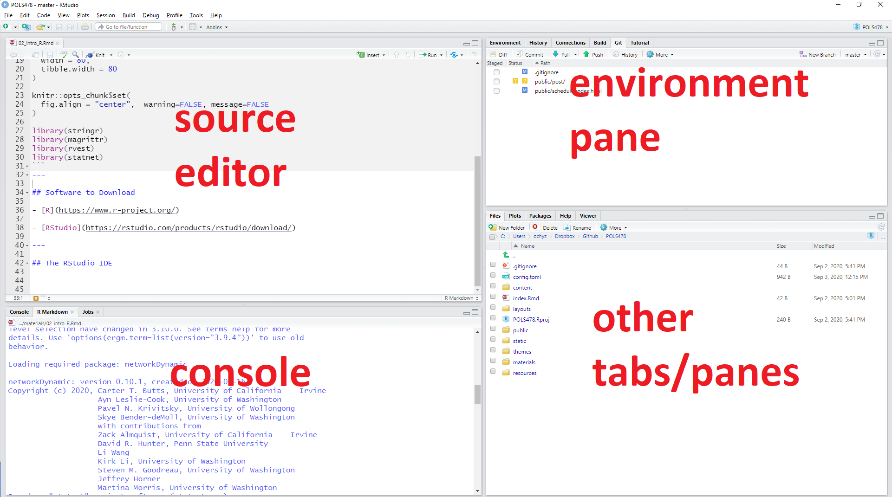

```{r  setup, message=FALSE, warning=FALSE, include=FALSE}
options(
  htmltools.dir.version = FALSE, # for blogdown
  width = 80,
  tibble.width = 80
)

knitr::opts_chunk$set(
  fig.align = "center",  warning=FALSE, message=FALSE
)

```

```{r, echo=F}
library(tidyverse)
library(magrittr)

```


## About me

- Assistant Professor of Political Science, since Fall 2020

- Previously an Assistant/Associate Professor of Political Science and Statistics at Iowa State University (2015-2020).

- My research areas are network analysis, spatial statistics, substantive focus on non-state violent actors

- [www.olgachyzh.com], olga.chyzh@utoronto.ca

---
## Outline

- Objectives, software

- Assessments

- Getting started


---
## "Tall-Order" Objective

- Get introduced to a range of cutting-edge techniques for analyzing political and social data


---
## Objectives

- Learn the conceptual basics behind each technique

- Understand its applications

- Apply to real data

- Breadth over depth

---
## Set-up

- About 2:1 split of class between teaching:practice

- After each class, upload your R script to Quercus to get credit.

---
## Assessments

- Participation, discussion of assigned readings --- 20%

- 3 assignments (20%, 20%, 30%) 
- Apply the tools learned in class to your own data.


- As we go through applications, start thinking of your own examples

---
## Lectures

- Slides, assignments, and all materials are posted on the [course website](www.pol304.netlify.app)

- Start working on the assignments today!

---
## What You Already Know

- Have you taken an Intro to Statistics? 

- Have you used R before?
 
- For more than a year?
---
## Software to Download

- [R](https://www.r-project.org/)

- [RStudio](https://rstudio.com/products/rstudio/download/)

---
## The RStudio IDE

```{r, echo=F, out.width= "1400px",fig.align="center"}

```


