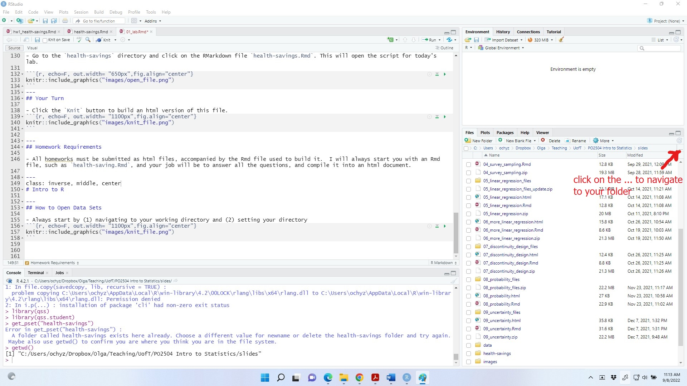
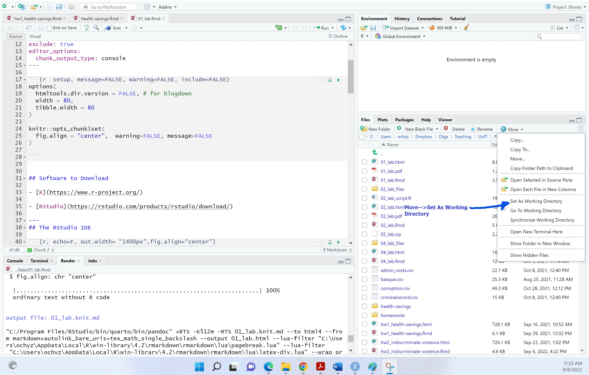

```{r setup,  include=FALSE}
knitr::opts_chunk$set(echo = TRUE)
```


## Always Start By...

- Navigating to your working directory 
```{r, echo=F, out.width= "1100px",fig.align="center"}

```

---
## And ...

- Setting your directory
```{r, echo=F, out.width= "1100px",fig.align="center"}

```

---
## Open Data Files

- To open `.csv` files, use `read.csv`

```{r}
rosca<-read.csv('./data/rosca.csv', header=TRUE)
```


---
## Access/Create a New Variable

```{r, eval=FALSE}
rosca$bg_female

rosca$new_var<- NA
```
---
## Subset Rows by Value

Suppose you want to see the values of the `fol2_amtinvest` variable only for women.

```{r, eval=FALSE}
rosca$fol2_amtinvest[rosca$bg_female==1]

##Or create a copy of the dataset that only includes women:
rosca1<- rosca$fol2_amtinvest[rosca$bg_female==1]
```
---
## Calculate the Mean

```{r, eval=FALSE}
mean(rosca$fol2_amtinvest, na.rm=TRUE)
mean(rosca$fol2_amtinvest[rosca$bg_female==1], na.rm=TRUE)

tapply(rosca$fol2_amtinvest, rosca$bg_female,mean, na.rm=TRUE)

```
---

## Tabulate Observations by Category


```{r, eval=FALSE}
table(rosca$bg_female)
```


---
## Your Turn

Create a single variable `treatment` that takes the value `control` for observations that received only encouragement, `safebox` if received a safe box, and `lockbox` if receiving a locked box. How many individuals are in the control group? How many individuals are in each of the treatment groups?

---
## Challenge Yourself

- Run the code below to install the `qss-package` and `qss.student` packages that go with the textbook.

```{r, echo=T, eval=F}
library(devtools)
devtools::install_github("kosukeimai/qss-package", build_vignettes = TRUE)
devtools::install_github("conjugateprior/qss.student")
library(qss)
library(qss.student)
```

- Run the code below to access the files that go with today's lab. This will put the files into a folder named "health-savings" in the directory you specified in 1.

```{r, echo=T, eval=F}
get_pset("health-savings")
```

- Complete the problem set.

