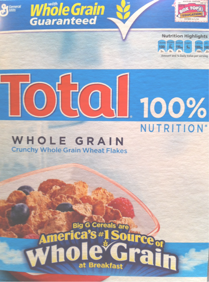
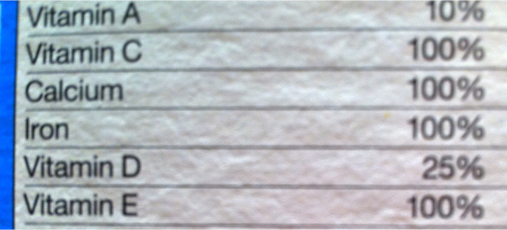
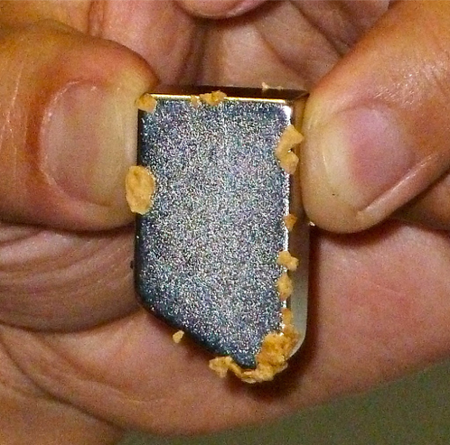
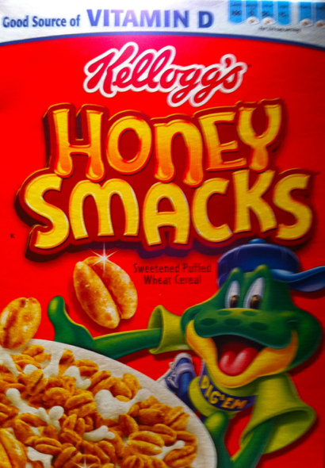
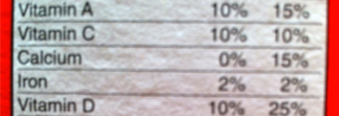
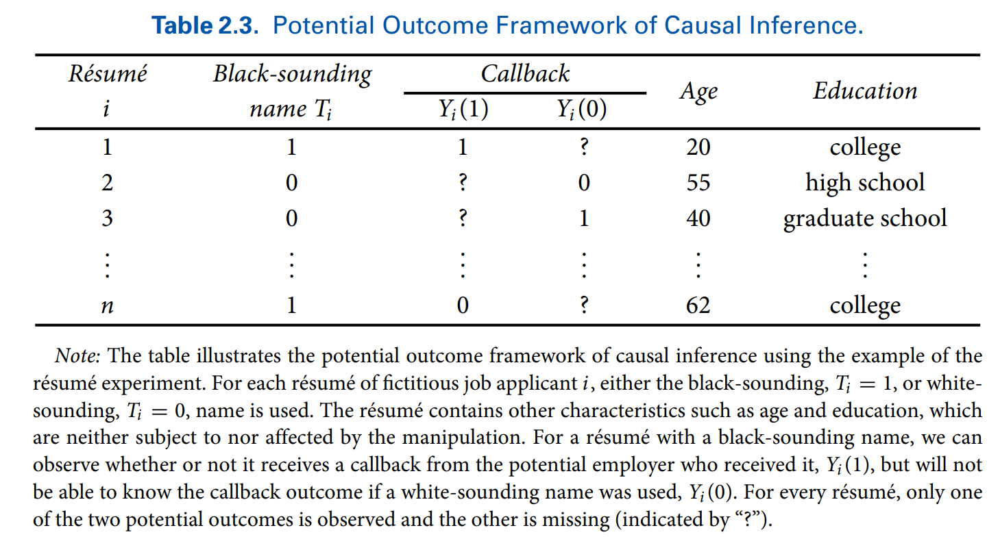

```{r  setup, message=FALSE, warning=FALSE, include=FALSE}
options(
  htmltools.dir.version = FALSE, # for blogdown
  width = 80,
  tibble.width = 80
)

knitr::opts_chunk$set(
  fig.align = "center",  warning=FALSE, message=FALSE
)

library(tidyverse)
library(magrittr)
library(devtools)
#devtools::install_github("kosukeimai/qss-package", build_vignettes = TRUE)
#devtools::install_github("conjugateprior/qss.student")
#library(qss)
#library(qss.student)
#get_pset("health-savings")

```

## Reading

- [Imai, Kosuke. Quantitative Social Science, Chapter 2 Sections 2.1, 2.3, and 2.4](https://assets.press.princeton.edu/chapters/s2-11025.pdf)


---
## Today's Class

- How to estimate causal effects with social science data?

- Two examples: 

    - breakfast cereal example
    
    - health savings experiment

---
## Very Healthy Cereal

.pull-left[
```{r, echo=F, out.width= "1200px",fig.align="center"}

```
]

.pull-right[
```{r, echo=F, out.width= "1200px",fig.align="center"}

```
]

---
## Empirical Observation

- This cereal sticks to a magnet.
```{r, echo=F, out.width= "500px",fig.align="center"}

```

---
## Why Did it Stick?

- Propose a theoretical model (that includes a causal mechanism) to explain the observation.

--

- Suppose our causal mechanism is that this cereal sticks to a magnet because of its iron content.

- A testable hypothesis: cereals that are high in iron stick to a magnet.


---
## Test
.pull-left[
```{r, echo=F, out.width= "1200px",fig.align="center"}

```
]

.pull-right[
```{r, echo=F, out.width= "1200px",fig.align="center"}

```
]

---
## Does It Stick?
- This cereal does not stick to a magnet.
```{r, echo=F, out.width= "350px",fig.align="center"}

```


---
## Causal Effect

- Unit of analysis: cereal type

- Treatment variable (causal variable of interest) $T$: iron content (high/low)

- Treatment group (treated units): Total cereal

- Control group (untreated units): Honey Smacks cereal

- Outcome variable (response variable) $Y$: whether it sticks to a magnet (yes/no).

---
## Causality

- Counterfactual: Would Total cereal stick to a magnet if it did not have iron?

- Two potential outcomes: $Y(1)$ and $Y(0)$

- Causal effect: $Y(1)-Y(0)$

- Fundamental problem of causal inference: only one of the two potential outcomes is observable.

- Cannot calculate individual causal effect $Y(1)-Y(0)$!

- Importance of control group.


---
## Can We Approximate Counterfactuals

- Association is not causation! (there could be confounders)

- *Confounding variable* is a pre-preatment variable that is associated with both the treatment and the outcome and may bias our estimation of the treatment effect.

- Matching: Find a unit that is the same as the those in the treatment group, except for the treatment.

- Is Honey Smacks a good match for Total cereal?

--

- Find another healthy cereal that has the same ingredients (other than iron), texture, etc.

---
## Strategy 1: Matching (A Quasi-Experiment)

- NJ increased the minimum wage. Does increase in min wage lead to unemployment?

    - Find a similar state to NJ that did not increase min wage.

    - Match to rule out potential confounders: e.g., compare only Burger Kings in urban areas

- Are Black people less likely to get job offers?

    - Find a white person who has the exact same credentials as a black person.
---
## Problem 

- Cannot match on everything

- Unobserved confounders: variables associated with treatment and outcome
    - Selection bias is confounding bias due to participant self-selection into the treatment/control groups.
    
    - Can you think of examples?
    
---
## Your Turn

- Suppose we are interested in the causal effect of alcohol on depression

- Propose a research design, such that:
    
    - units in the treatment group engage in high alcohol consumption, while units in the control group do not
    
    - the treatment and the control group do not differ in other ways that may be correlated with alcohol consumption and depression
    
    - units did not self-select into treatment/control groups
    


---
## Randomized Control Trials (RCT)

- Random assignment of participants (observations) by the researcher into the treatment/control groups.

    - How would you do this in practice?

- Key idea: Randomization of the treatment makes the treatment and control groups “identical” on average

- The two groups are similar in terms of all (both observed and unobserved) characteristics

- Can attribute the average differences in outcome to the difference in the treatment

$$\text{Sample Average Treatment Effect (SATE)}=\frac{1}{n}\sum\limits_{i=1}^{n}\{Y_i(1)-Y_i(0)\}$$
- SATE is not observable, but can estimate as $\bar{Y}(1)-\bar{Y}(0)$

- Randomized experiments are the gold standard

- Double-blind experiments: Placebo effects and Hawthorn effects

???

Hawthorn effect is changing behavior because you are being studied.


---

```{r, echo=F, out.width= "1200px",fig.align="center"}

```

---

## Using Technology to Increase Savings

- Question: How to encourage people to save for emergency healthcare?<sup>1</sup>

- A small amount of investments in preventative health products (e.g.,
bed nets, water filters) can save many lives in developing countries

- Hypothesis: simple saving technologies can increase investments

- A randomized field experiment in Kenya
    - control: encouraged to save, no device given
    - T1: metal safe box with the key given to participants
    - T2: same box but the key given to officers,  participants must ask officers to open the box at a shop

- Outcome: amount of savings for health products 6 and 12 months later

.footnote[
<sup>1</sup> Dupas, Pascaline and Jonathan Robinson. 2013. “Why Don’t the Poor Save More? Evidence from Health Savings Experiments.” American Economic Review, Vol. 103, No. 4, pp. 1138-1171.
]

---
## Study Design

- Randomized treatment

    - 111 control, 195 lockbox, 117 safe box

- Outcome measured in follow-up surveys after 6 and 12 months

    - 102 are in the control group, 184 have received a locked box, 107 have received a safe box.

- Why have a control group rather than compare the treatment groups to the savings rates in the population?

- Does the drop-out rate differ across the treatment conditions? What does this result suggest about the internal and external validity of this study?

---
## Internal and External Validity

- *Internal validity*--- the extent to which causal assumptions are satisfied in the study.

- *External validity*---the extent to which the conclusions can be generalized beyond a particular study.

---
## Calculate SATE

Control: $\bar{Y}(0)= 257.83$

Lockbox: $\bar{Y}^{T_1}(1)= 307.83$

Safe box: $\bar{Y}^{T_2}(1)= 408.22$

$SATE_{T_1}=307.83-257.83=50$

$SATE_{T_2}=408.22-257.83=150.39$
---
## Examine the Balance

- If randomization "took", the experimental groups should be roughly equal on the pre-treatment variables (e.g., gender, marital status, age).

.center[Gender]
```{r, eval=T, echo=F}
rosca<-read.csv("./data/rosca.csv")
rosca$treatment <- NA
rosca$treatment[rosca$encouragement == 1] <- "control"
rosca$treatment[rosca$safe_box == 1] <- "safebox"
rosca$treatment[rosca$locked_box == 1] <- "lockbox"
rosca$treatment <- as.factor(rosca$treatment)
rosca2 <- rosca[rosca$has_followup2 == 1, ]
mytable<-round(tapply(rosca2$bg_female, rosca2$treatment, mean),2)
knitr::kable(t(mytable))

```

.center[Age]
```{r, echo=F}
mytable<-round(tapply(rosca2$bg_b1_age, rosca2$treatment, mean),2)
knitr::kable(t(mytable))
```

.center[Marital Status]
```{r, echo=F}
mytable<-round(tapply(rosca2$bg_married, rosca2$treatment, mean),2)
knitr::kable(t(mytable))
```

---
## Subset Analysis

- If we think that the groups are unbalanced, despite randomization, can compare means within subsets.

.center[Married Women Only]
```{r, echo=F}
rosca2.married <- subset(rosca2, subset = (bg_married == 1) & (rosca2$bg_female == 1))
mytable <-round(tapply(rosca2.married$fol2_amtinvest, rosca2.married$treatment, mean),2)
knitr::kable(t(mytable))
```


.center[Unmarried Women Only]

```{r, echo=F}
rosca2.married <- subset(rosca2, subset = (bg_married == 0) & (rosca2$bg_female == 1))
mytable <-round(tapply(rosca2.married$fol2_amtinvest, rosca2.married$treatment, mean),2)
knitr::kable(t(mytable))
```


---
## What You Learned or Already Knew

- How to generate a research question (an inductive approach)

- How to propose a theoretical model (causal mechanism) and derive a testable hypothesis

- Concepts: unit of analysis, treatment/control variable, treatment/control group, outcome variable, counterfactual, potential outcomes, causal effect, confounders, matching, selection bias, random assignment, SATE, randomized experiment, placebo effect, hawthorn effect, attrition/drop-out rate, internal and external validity, balance, subset analysis.


---
## Review Questions

1. What was the goal of the cereal example? What did it demonstrate?

2. How does randomization account for confounders? What is the exact mechanism?

3. What is the difference between a natural experiment (quasi-experiment) and a randomized controlled trials?

4. What is selection effect and how do randomized controlled trials rule it out?

---
## Before Next Class

- Install R and RStudio

- Complete assigned readings

- Next Class: causality, experimental design, a two-sample t-test


