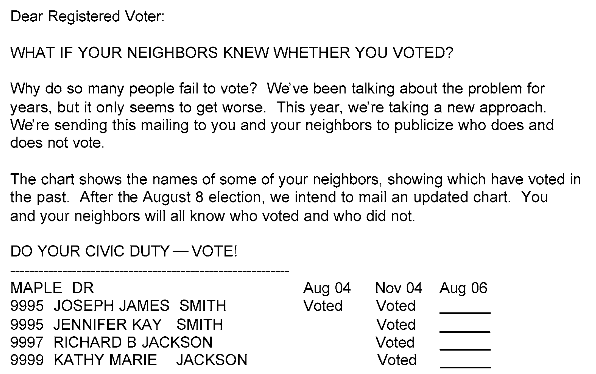
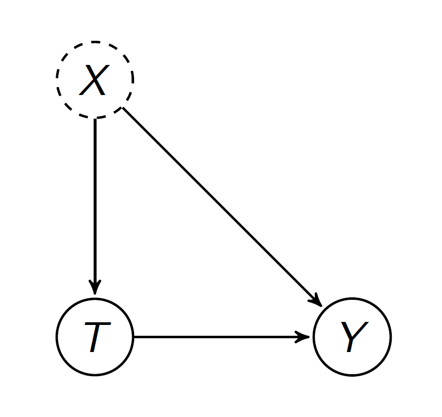
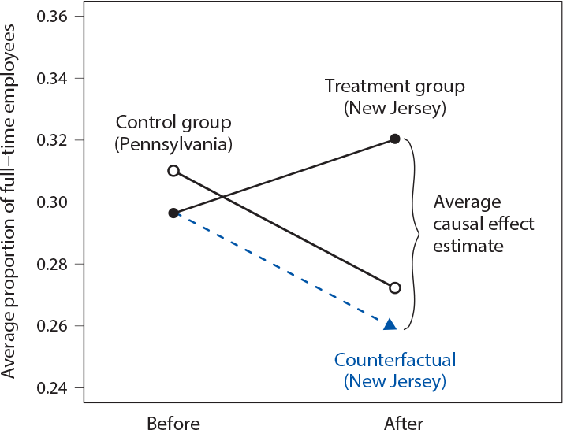

```{r  setup, message=FALSE, warning=FALSE, include=FALSE}
options(
  htmltools.dir.version = FALSE, # for blogdown
  width = 80,
  tibble.width = 80
)

knitr::opts_chunk$set(
  fig.align = "center",  warning=FALSE, message=FALSE
)

library(tidyverse)
library(magrittr)
library(devtools)
#devtools::install_github("kosukeimai/qss-package", build_vignettes = TRUE)
#devtools::install_github("conjugateprior/qss.student")
library(qss)
#library(qss.student)
#get_pset("health-savings")

```

## What You Did in Preparation for Today

- Chapter 2 Sections 2.5

---
## Today's Agenda

- Review randomized controlled trials:

    - Role of randomization
    
    - Social pressure experiment (optional)

- Review Sections 2.5 and 2.6 of QSS:

    - Observational studies
    
    - Confounding bias
    
    - Cross-section, before-and-after, and difference-in-differences designs

    - Minimum wage study
    
---
##  Review of Randomized Control Trials

- Fundamental problem of causal inference:

    - Comparison between factual and counterfactual
    
    - Counterfactuals are not observed

- Solution: Randomized controlled trials (RCTs)

    - Treatment and control groups identical on average

    - Similar in all (observed and unobserved) characteristics

    - Difference in average outcome between the two groups, $\bar{Y}(1)-\bar{Y}(0)$, is an estimate of 

$$\text{Sample Average Treatment Effect (SATE)}=\\\frac{1}{n}\sum\limits_{i=1}^{n}\{Y_i(1)-Y_i(0)\}$$
---

## Examples of RCTs

- Causal effect of safe/locked box on health savings

- Causal effect of race on employment prospect

- Causal effect of naming-and-shaming on turnout
---

## Social Pressure Experiment [Optional]

- August 2006 Primary Statewide Election in Michigan<sup>1</sup>

- Send postcards with different (randomly assigned) messages

1. no message (control group)

2. civic duty message

3. “you are being studied” message (Hawthorne effect)

4. neighborhood social pressure message

.footnote[
<sup>1</sup> Gerber, Alan S., Donald P. Green, and Christopher W. Larimer. 2008. "Social pressure and voter turnout: Evidence from a large-scale field experiment." *American Political Science Review* 102 (1): 33--48.
]

---
```{r, echo=F, out.width= "1000px",fig.align="center"}

```

---
## Analysis

.center[Turnout by Group:]
```{r, echo=F}
library(qss)
data(social)
mytable<-tapply(social$primary2006, social$messages, mean)
knitr::kable(t(mytable))
```

.center[SATE for each group:]
```{r, echo=F}
mytable<-tapply(social$primary2006, social$messages, mean)[-2] -
mean(social$primary2006[social$messages == "Control"])
knitr::kable(t(mytable))

```

- Randomization balances covariates across groups:

.center[Primary 2004 for each group:]
```{r, echo=F}
mytable<-tapply(social$primary2004, social$messages, mean)
knitr::kable(t(mytable))
```

---

## Observational Studies

- Often, we can’t randomize treatment for ethical and logistical reasons:

    - e.g., smoking and lung cancer
    
- Observational studies: naturally assigned treatment

- Better external validity for generalization beyond experiment

- Weaker internal validity:
    
    - pre-treatment variables may differ between treatment and control groups
    
    - confounding bias due to these differences

    - selection bias from self-selection into treatment

    - statistical control needed

    - unobserved confounding poses a threat

---
## Confounding

```{r, echo=F, out.width= "300px",fig.align="center"}

```

- Key assumption “Unconfoundedness”: treatment and control groups comparable with respect to everything other than treatment

- How can we find a good comparison group?

---
## Asthma in Children [Optional]

- New evidence for the role of microbes from farm animals in dust

- Comparison of Amish and Hutterites:

    - similar genetic backgrounds, large families, and a simple communal life style

    - diets are similar, little exposure to tobacco or pollution, both groups prohibit indoor pets, meticulously clean homes

- Rates of asthma in children: 2–4% (Amish) vs. 15–20% (Hutterites)

- Findings:

    - Amish do not use electricity, but Hutterites do
    
    - Amish kids play in animal barns
    
    - Amish kids have better immune system, leading to less allergic reaction
    
    - Giving Amish house dust to mice protected them from allergens whereas Hutterites house dust did not

---
## Minimum Wage and Unemployment

- How does the increase in minimum wage affect employment?

- Current debate: federal minimum wage increase

- Many economists believe the effect is negative

    - especially for the poor
    
    - also for the whole economy
    
- Hard to randomize the minimum wage increase

- Two social scientists tested this using fast food chains in NJ and PA

    - In 1992, NJ minimum wage increased from $4.25 to $5.05

    - Neighboring PA stays at $4.25

- Observe employment in both states before and after increase

- NJ and (eastern) PA are similar

- Why limit to fast food chains?

???

Fast food chains are the most affected by min wage

---
## Did the Minimum Wage Law Affect the Wages in NJ?

.center[Before]
```{r, echo=F}
data(minwage)
minwage <- minwage %>% mutate(state=ifelse(location=="PA","PA","NJ"), 
                              wagebelow505Before=ifelse(wageBefore<5.05,1,0),
                              wagebelow505After=ifelse(wageAfter<5.05,1,0),
                              fullPropBefore=fullBefore/(fullBefore+partBefore),
                              fullPropAfter=fullAfter/(fullAfter+partAfter))
mytable<-table(minwage$state, minwage$wagebelow505Before)
mytable<-round(proportions(mytable,1),2)
colnames(mytable)<-c("> 5.05","< 5.05")
knitr::kable(mytable)
```

.center[After]
```{r, echo=F}
mytable<-table(minwage$state, minwage$wagebelow505After)
mytable<-round(proportions(mytable,1),3)
colnames(mytable)<-c("> 5.05","< 5.05")
knitr::kable(mytable)
```
---
## Are the NJ and PA Restaurants Comparable?

Average wages before the increase in minimum wage:

```{r, echo=F}
mytable<-round(tapply(minwage$wageBefore, minwage$state, mean),2)
knitr::kable(t(mytable))
```

Prior proportion of fulltime employment:

```{r, echo=F}
mytable<-round(tapply(minwage$fullPropBefore, minwage$state, mean),3)
knitr::kable(mytable)
```

---
## Cross-Section Comparison

- Compare NJ and PA using the data after the increase

- The treatment and control groups are assumed to be identical on average in terms of all confounders

- What confounders are missing from the data?

- Assumptions:

    - No cross-sectional contamination
    
    - No cross-sectional confounders

- Compute the proportion of fulltime employees after the increase:

$$\bar{Y}(1)-\bar{Y}(0)=\bar{Y}(NJ_{after})-\bar{Y}(PA_{after})=0.0481$$ 


```{r, eval=F, echo=F}
round(mean(minwage$fullPropAfter[minwage$state=="NJ"])-mean(minwage$fullPropAfter[minwage$state=="PA"]),4)
```

- Here, NJ (after the increase) is the treatment group and PA (after the increase in NJ) is the control group.

- This is our estimated SATE. Why "estimated"?

???

The actual SATE is not observed due to the fundamental probelem of never observing the counter-factual.


---
## Before and After Comparison

- State-specific confounders for cross-section comparison

- Compare NJ before and after

- Assumptions:

    - No temporal contamination (treatment is exogenous)
    
    - No (temporal) confounders

- What might be time-varying confounders?

$$\bar{Y}(1)-\bar{Y}(0)=\bar{Y}(NJ_{after})-\bar{Y}(NJ_{before})=0.0239$$
- Here, NJ (after the increase) is the treatment group and NJ (before the increase) is the control group.

---
## Difference-in-Difference

- Key Idea: use PA before-and-after difference to figure out what would have happened in NJ without the increase

- NJ before-and-after difference addresses within-state confounding

- Assumptions:

    - Parallel time trends (how good is our control group)
    
    - Treatment is exogenous (no temporal or cross-sectional contamination)
    
- Estimate the sample average treatment effect for the treated (SATT), NOT SATE

$$\bar{Y}(NJ_{after})-\bar{Y}(NJ_{before})-\\
(\bar{Y}(PA_{after})-\bar{Y}(PA_{before}))=0.0616$$

---
## Visualizing Difference-in-Difference
```{r, echo=F, out.width= "600px",fig.align="center"}

```
---
## The Difference-in-Difference Design

- A natural experiment always has the control group (observations not affected by the change) and the treatment group (observations that are affected).

- Need data for two time periods (before and after the treatment).

- Thus, four groups of observations: control before, treatment before, control after, treatment after

- The difference between the two *before* groups helps account for the differences between the treatment and control groups that are not caused by the treatment.


---
## Summary of 3 Identification Strategies

1. Cross-section comparison

    - Compare treated units with control units after the treatment

    - Assumption: the treated and control units are comparable

    - Possible unit-specific confounding

2. Before-and-after comparison

    - Compare the same units before and after the treatment

    - Assumption: no time-varying confounding

3. Difference-in-Differences

    - Assumption: parallel time trend

    - Under this assumption, it accounts for both unit-specific and time-varying confounding

- None of the approaches is best. They require different assumptions.
---
## Incinerator and Home Prices [Optional]

Suppose we would like to study the effect of proximity to a garbage incinerator on home prices.

- Propose a cross-sectional natural experiment design to study this question. What is the key assumption for this design? Does it hold? 

- Propose a before-and-after comparison design to study this question. What is the key assumption for this design? Does it hold? 

- Propose a diff-in-diff design to study this question. What is the key assumption for this design? Does it hold? 

- Which of the proposed design would work the best in this example?

