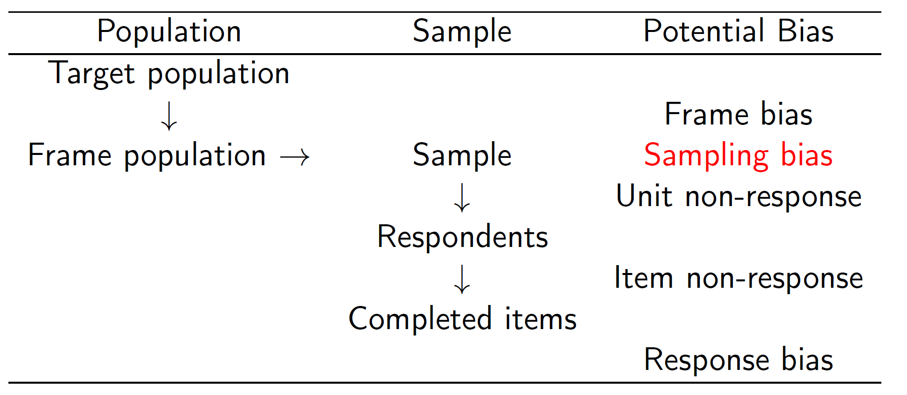

```{r  setup, message=FALSE, warning=FALSE, include=FALSE}
options(
  htmltools.dir.version = FALSE, # for blogdown
  width = 80,
  tibble.width = 80
)

knitr::opts_chunk$set(
  fig.align = "center",  warning=FALSE, message=FALSE
)

library(kableExtra)
library(tidyverse)
library(magrittr)
library(devtools)
#devtools::install_github("kosukeimai/qss-package", build_vignettes = TRUE)
#devtools::install_github("conjugateprior/qss.student")
library(qss.student)
#get_pset("health-savings")

```


## Today's Agenda

- Review Sections 3.1, 3.4.2 of QSS Chapter 3

    - Role of randomization in survey sampling
    
    - Non-response and other sources of bias 
    

    
---
class: inverse, middle, center
# Survey Sampling

---
##  Support for Biden's Covid-19 Plan

   | Favor|
---------------------------------------------|----
Require vaccines for federal govt employees | 60% 
Require companies with $\geq100$ employees to implement vaccine mandates | 58 
Require healthcare facilities that receive Medicaid or Medicare money to implement vaccine mandates | 63 
Require companies with $\geq100$ employees to provide paid time off for employees to get vaccinated | 68 

Results for this Gallup poll are based on self-administered web surveys conducted Sept. 13-19, 2021, with a random sample of 4,034 adults, aged 18 and older, who are members of the Gallup Panel. Gallup uses probability-based, random sampling methods to recruit its Panel members.
---

## Problem

- Most surveys/polls only interview several hundred people/voters

- Goal: infer what 200 million adults are thinking
---

## The 1936 Literary Digest Poll

- Source: automobile registration, telephone books, etc. 

- Initial sample size: over 10 million straw vote ballots 

- Final sample size: over 2.3 million returned 

- The young Gallup used 50,000 respondents


   | FDR's Vote Share |
---|------------------
Literary Digest | 43
Gallup | 56
Gallup's prediction for LD |44 
**Actual Outcome** | **62**
   

???

- Parameter: election outcome

- Data: a sample of respondents answering the question of which
  candidate they support

- FDR (incumbent; from 1933 to 1945) vs. Alfred Landon (Kansas
  Governor)

- Recovering from the Great Depression: New Deal

- Selection bias: the initial frame -- screened out poor (only 1/4
  households had telephones)

- Gallup used only 3,000 to predict the Literary Digest's
  prediction in way advance

- Poor voted for Roosevelt

- Literary Digest went bankrupt afterward

- But, Gallup was also a bit off

---
## The 1948 Election
```{r, echo=F, out.width= "1200px",fig.align="center"}

```
???

- Harry Truman (incumbent; vice president of FDR who died in the
  office), Thomas Dewey (NY Governor)

- World War II ending, the Cold War starting

- Everyone thought Truman was going to lose

- In fact, the newspaper went into press with the wrong news!

- Why did the newspaper get the results wrong? 

---
## The Polling Disaster

| Truman| Dewey | Thurmond | Wallace |
------------|-------|-------|-----------|-----------  
Crossley |     45 |    50 |        2 |       3 
Gallup   |     44 |    50 |        2 |       4 
Roper    |     38 |    53 |        5 |       4 
**Actual Outcome** | **50** | **45** | **3** | **2** 

- Quota sampling!

- fixed quota of certain respondents for each interviewer

- sample resembles the population with respect to these characteristics

- potential unobserved confounding $\rightsquigarrow$ *selection bias*

???

- Quota sampling also suffers from potential bias with respect to
  the characteristics that are not used to create quotas

- you can make sex, age, race, rent, etc. identical in
  distribution between the sample and the population

- but that is not enough to make the distributions of Democratic
  and Republican votes identical to that in the population

- There are always other factors that affect the outcome of
  interest

- interviewers are free to choose within quota; tend to contact
  those who are easier to reach (having a telephone etc.)  

- Republicans were wealthier than Democrats; they were more likely
  to interview Republicans -- Republican bias
  
---
## Sample Surveys

- *Probability sampling* to ensure representativeness 

- Definition: every unit in the population has a known non-zero
    probability of being selected 

- *Simple random sampling*: every unit has an *equal* selection probability

```{r, echo=F, out.width= "1200px",fig.align="center"}

```

???

- Randomly sample units with some known probabilities 

- Inferential population $=$ eligible voters

- Frame population $=$ phone numbers listed in a phone book

- Probability vs. non-probability sampling; the former removes
  sampling bias
  
- The decision to answer or not to answer isn't random

- Response bias: lying, confusion, interviewer bias

---

## Civilian Attitudes and War against Insurgency

- Conventional war: military against another military

- Counter-insurgency war: military against insurgents

     - From Vietnam war to war in Afghanistan
    
     - Key to victory: winning hearts and minds of civilians
     
     - aid provision, information campaign, minimizing civilian casualties

---

## Non-Response and Other Sources of Bias

- Item non-response, like unit non-response, can create bias

- More violent areas $\rightsquigarrow$   more non-response

.center[Missing Values by Region: Support for the Taliban]
```{r, echo=FALSE}
afghan <- read.csv("data/afghan.csv")
mytable<-round(tapply(is.na(afghan$violent.exp.taliban), afghan$province, 
       mean),3)
kable(t(mytable))
```

.center[Missing Values by Region: Support for the ISAF]
```{r, echo=FALSE}
mytable<-round(tapply(is.na(afghan$violent.exp.ISAF), afghan$province, 
       mean),3)
kable(t(mytable))
```

- Sensitive questions $\rightsquigarrow$  non-response, social desirability bias

- racial prejudice, corruption, even turnout

---
## List Experiment

- Script for *control group*:

 I'm going to read you a list with the names of
  different groups and individuals on it. After I read the entire
  list, I'd like you to tell me how many of these groups and
  individuals you broadly support, meaning that you generally agree
  with the goals and policies of the group or individual. Please don't
  tell me which ones you generally agree with; only tell me how many
  groups or individuals you broadly support.
  
- Karzai Government; National Solidarity Program; Local
Farmers

---

## List Experiment

- Script for *treatment group*:    

  I'm going to read you a list with the names of
  different groups and individuals on it. After I read the entire
  list, I'd like you to tell me how many of these groups and
  individuals you broadly support, meaning that you generally agree
  with the goals and policies of the group or individual. Please don't
  tell me which ones you generally agree with; only tell me how many
  groups or individuals you broadly support.
  
-  Karzai Government; National Solidarity Program; Local
Farmers; ISAF (Taliban)


---

## Analysis of List Experiment

$$\text{Proportion of those who support ISAF}= \bar{Y}(1)-\bar{Y}(0)= 0.049$$

- Problems with list experiments: floor and ceiling effects

```{r, echo=FALSE}
mytable<-table("response" = afghan$list.response,
"group" = afghan$list.group)

rownames(mytable)<-NULL
mytable<-cbind("response"=c(0,1,2,3,4),mytable)

kable(mytable)
```
---
## Summary

Importance of probability sampling:

1. ensures representativeness

2. enables the calculation of uncertainty (QSS Chapter 7)

Sources of bias in survey sampling

1. unit non-response

2. item non-response

3. social desirability bias

4. differential item functioning

Survey methods for sensitive questions

1. list experiment

2. randomize response method

---
class: inverse, middle, center
# Lab

---
## Political Efficacy in China and Mexico

- Goal: explore research tools for correcting survey measurement bias

- In 2002, the World Health Organization conducted a survey of two
provinces in China and three provinces in Mexico. This
exercise is based on: 

- Gary King, Christopher J. L. Murray, Joshua A. Salomon, and Ajay Tandon. (2004). '[Enhancing the Validity and Cross-Cultural Comparability of Measurement in Survey Research.]( https://doi.org/10.1017/S000305540400108X)' *American Political Science Review*, 98:1 (February), pp.191-207.

---
## Self-Assessment Question

How much say do you have in getting the government to address issues that interest you?

(5) Unlimited say, (4) A lot of say, (3) Some say, (2) Little say, (1) No say at all.
---
## Data Exercise

- Download and open the data.

```{r, echo=FALSE}
vig <- read.csv("data/vignettes.csv")
```

- Compute the mean response for each country. 

- Plot the distribution of responses separately for China and Mexico using
barplots, where the vertical axis is the proportion of respondents.

```{r, eval=FALSE, echo=TRUE}
vig_chi <- subset(vig, china == 1)
vig_mex <- subset(vig, china == 0)

# China
chi_table <- prop.table(table(vig_chi$self))
barplot(chi_table, main = "China")

# Mexico
mex_table <- prop.table(table(vig_mex$self))
barplot(mex_table, main = "Mexico")

```

---
## How Much Say Do You Have? 
```{r, echo=F, eval=TRUE}
library(ggplot2)
vig$china <- factor(vig$china, levels = c("0","1"), 
                  labels = c("Mexico", "China"))
vig$self <- factor(vig$self, levels = c(1:5), 
                  labels = c("Not at all","Little","Some","A lot", "Unlimited"))
ggplot(data=vig, aes(x=self))+geom_bar(aes(y=(..count..)/sum(..count..)))+facet_wrap(china~.)+xlab("Self-Efficacy")+ ylab("Percent Respondents")+theme_bw()

```

---
## Data Exercise Cont'd

- Which country's respondents seem to have a higher degree of political efficacy?  Does this seem plausible when Mexican citizens voted out out the Institutional Revolutionary Party (PRI) after more than 70 years or rule and Chinese citizens have not been able to vote in a fair election to date?

---
## Vignettes

After the self-assessment question, three vignette questions were
asked.

- [Alison] lacks clean drinking water. She and her neighbors are supporting an opposition candidate in the forthcoming elections that has promised to address the issue. It appears that so many people in her area feel the same way that the opposition candidate will defeat the incumbent representative.

- [Jane] lacks clean drinking water because the government is pursuing an industrial development plan. In the campaign for an upcoming election, an opposition party has promised to address the issue, but she feels it would be futile to vote for the opposition since the government is certain to win.

- [Moses] lacks clean drinking water. He would like to change this, but he can't vote, and feels that no one in the government cares about this issue. So he suffers in silence, hoping something will be done in the future.

The respondent was asked to assess each vignette in the same manner as
the self-assessment question.

- How much say does ['name'] in getting the government to address issues that interest [him/her]?

(5) Unlimited say, (4) A lot of say, (3) Some say, (2) Little say, (1) No say at all.

---
## Your Turn

- Compute the proportion of respondents, again separately for China and Mexico, who ranks themselves (according to the self-assessment question) as having less say in the government’s decisions than Moses (the last vignette).

- How many respondents in China think they have less say than Moses?

- How many respondents in Mexico think they have less say than Moses?

- What does this tell you?

---
## Challenge Yourself

- Restrict the data to survey respondents who ranked these three vignettes
in the expected order (i.e., `Alison` $\ge$ `Jane` $\ge$
`Moses`).  

- Now create a variable that represents how respondents
rank themselves relative to each vignette.  This variable should
be equal to 1 if a respondent ranks themselves lower than
`Moses`, 2 if ranked the same as `Moses` or higher than
`Moses` but lower than `Jane`, 3 if ranked the same as `Jane`
or higher than `Jane` but lower than `Alison`, and 4 if ranked as high as `Alison` or higher.  

- Create the barplots of this new variable as in Question 1.  The vertical axis should represent the proportion of respondents for each response category. Also,
compute the mean value of this new variable separately for China and
Mexico.  Compare these results with those obtained in Question 1.

