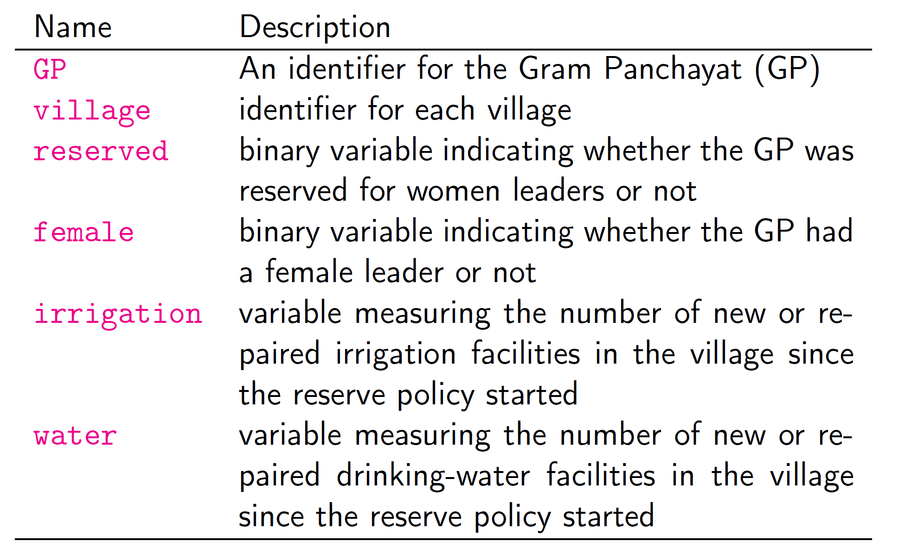
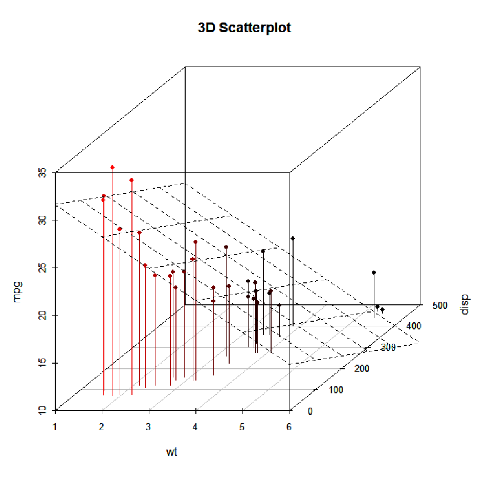

```{r  setup, message=FALSE, warning=FALSE, include=FALSE}
options(
  htmltools.dir.version = FALSE, # for blogdown
  width = 80,
  tibble.width = 80
)

knitr::opts_chunk$set(
  fig.align = "center",  warning=FALSE, message=FALSE
)

library(kableExtra)
library(tidyverse)
library(magrittr)


```


## Today's Agenda

- Review of Section 4.3 of QSS Chapter 4

    - Regression and causality
    
    - Regression with multiple predictors (categorical IV)
    
---

## Which Person is the More Competent?
```{r, echo=F, out.width= "1200px",fig.align="center"}
knitr::include_graphics("./images/face.png")
```

- 2004 Wisconsin Senate Race

--

- Russ Feingold (D) 55% vs. Tim Micheles (R) 44%

    
---
## Facial Competence and Vote Share

```{r, echo=F}
face <- read.csv("data/face.csv")
face$d.share <- face$d.votes /
    (face$d.votes + face$r.votes)
face$r.share <- face$r.votes /
    (face$d.votes + face$r.votes)
face$diff.share <- face$d.share - face$r.share
face$w.party <- as.character(face$w.party)
plot(face$d.comp, face$diff.share, pch = 16,
     col = ifelse(face$w.party == "R", "red", "blue"),
     xlim = c(0, 1), ylim = c(-1, 1),
     xlab = "Competence scores for Democrats",
     ylab = "Democratic margin in vote share",
     main = "Facial Competence and Vote Share")
```
---

## Best Fit Line

```{r, echo=F, out.width= "500px",fig.align="center"}
plot(face$d.comp, face$diff.share, pch = 16,
     col = ifelse(face$w.party == "R", "red", "blue"),
     xlim = c(0, 1), ylim = c(-1, 1),
     xlab = "Competence scores for Democrats",
     ylab = "Democratic margin in vote share",
     main = "Facial Competence and Vote Share")
abline(lm(diff.share ~ d.comp, data = face), lty = "dashed")
```

---

## Linear Regression Model

- Model

$$\begin{eqnarray*}
      Y & = & \underbrace{\alpha}_{\textsf{intercept}} +
              \underbrace{\beta}_{\textsf{slope}}  X +
              \underbrace{\epsilon}_{\textsf{error term}} 
\end{eqnarray*}$$

- $Y$: dependent/outcome/response variable

- $X$: independent/explanatory variable, predictor

- $(\alpha, \beta)$: coefficients (parameters of the model)

- $\epsilon$: unobserved error/disturbance term (mean zero)

---

## Interpretation:

- $\alpha + \beta X$: mean of $Y$ given the value of $X$

   - This is the line

- $\beta$: increase in $Y$ associated with one unit increase in $X$
   
   - For every 1-unit increase in $X$, there is a $\beta$ change in $Y$
   
   - This works in reverse as well: For every 1-unit decrease in $X$, there is a $-\hat{\beta}$ change in $Y$

- $\alpha$: the value of $Y$ when $X$ is zero

  - Be careful! This number is not always meaningful

				
---
## Facial Competence and Vote Share

```{r, echo=F}
fit <- lm(diff.share ~ d.comp, data = face)
CurlyBraces <- function(x0, x1, y0, y1, pos = 1, direction = 1, depth = 1, color = "black") {

    a=c(1,2,3,48,50)    # set flexion point for spline
    b=c(0,.2,.28,.7,.8) # set depth for spline flexion point

    curve = spline(a, b, n = 50, method = "natural")$y * depth

    curve = c(curve,rev(curve))

    if (pos == 1){
        a_sequence = seq(x0,x1,length=100)
        b_sequence = seq(y0,y1,length=100)
    }
    if (pos == 2){
        b_sequence = seq(x0,x1,length=100)
        a_sequence = seq(y0,y1,length=100)
    }

    # direction
    if(direction==1)
        a_sequence = a_sequence+curve
    if(direction==2)
        a_sequence = a_sequence-curve

    # pos
    if(pos==1)
        lines(a_sequence,b_sequence, lwd=1.5, xpd=NA, col = color) # vertical
    if(pos==2)
        lines(b_sequence,a_sequence, lwd=1.5, xpd=NA, col = color) # horizontal

}
plot(face$d.comp, face$diff.share, xlim = c(0, 1.05), ylim = c(-1, 1),
     xlab = "Competence scores for Democrats",
     ylab = "Democratic margin in vote share",
     main = "Facial Competence and Vote Share")
abline(fit) # add regression line
abline(v = 0, lty = "dashed")
## misc
arrows(x0 = 0.1, y0 = -0.75, x1 = 0, y1 = coef(fit)[1], length = 0.1)
text(0.1, -0.8, "intercept")
text(0.1, -0.9, expression(hat(alpha)))
lines(rep(face$d.comp[10], 2), c(face$diff.share[10], fitted(fit)[10]))
arrows(x0 = 0.8, x1 = face$d.comp[10]-0.01, y0 = -0.2,
       y1 = face$diff.share[10] - 0.01, length = 0.1)
text(0.8, -0.225, "outcome")
text(0.8, -0.35, expression(y))
CurlyBraces(x0=face$d.comp[10], x1=face$d.comp[10], y0=face$diff.share[10],
            y1=fitted(fit)[10], pos = 1, direction = 1, depth=0.035, color = "black")
text(0.98, (face$diff.share[10] + fitted(fit)[10])/2, "residual")
text(0.98, (face$diff.share[10] + fitted(fit)[10])/2-0.1, expression(hat(epsilon)))
arrows(x0 = 0.98, x1 = face$d.comp[10] + 0.01, y0 = 0.5, y1 = fitted(fit)[10] + 0.01,
       length = 0.1)
text(0.98, 0.56, expression(hat(y)))
text(0.98, 0.75, "predicted\n value")
abline(v = mean(face$d.comp), lty = "dotted")
text(mean(face$d.comp) + 0.1, -1, expression(bar(x)))
text(mean(face$d.comp) + 0.1, -0.9, "mean of x")
abline(h = mean(face$diff.share), lty = "dotted")
text(0.1, mean(face$diff.share) + 0.075, "mean of y")
text(0.1, mean(face$diff.share) - 0.075, expression(bar(y)))
points(mean(face$d.comp), mean(face$diff.share), pch = 19)
```

---
## Women as Policy Makers

- Do women promote different policies than men?

- Observational studies: compare policies adopted by female politicians with those adopted by male politicians

- Randomized natural experiment:

    - one third of village council heads reserved for women
    
    - assigned at the level of Gram Panchayat (GP) since mid-1990s
    
    - each GP has multiple villages

- What does the effects of female politicians mean?

- Hypothesis: female politicians represent the interests of female voters

- Female voters complain about drinking water while male voters complain about irrigation

---

```{r, echo=F, out.width= "1200px",fig.align="center"}

```

---
## Does the reservation policy increase female politicians?

Proportions of women in reserved/non-reserved GP:
```{r, echo=F}
women <- read.csv("data/women.csv")
mytable<-c(mean(women$female[women$reserved == 1]),round(mean(women$female[women$reserved == 0]),3))
names(mytable)<-c("Reserved","Not Reserved")
kable(t(mytable))
```
---
## Does it change the policy outcomes?

```{r}
## drinking-water facilities
mean(women$water[women$reserved == 1]) -
    mean(women$water[women$reserved == 0])
## irrigation facilities
mean(women$irrigation[women$reserved == 1]) -
    mean(women$irrigation[women$reserved == 0])
```

---
## Slope Coefficient = Difference-in-Means Estimator

- Randomization enables a causal interpretation of estimated regression
coefficient $\rightsquigarrow$ this is not always the case

```{r}
mean(women$water[women$reserved == 1]) -
    mean(women$water[women$reserved == 0])
lm(water ~ reserved, data = women)
```


---

## Linear Regression with Multiple Predictors

The model:

$$
\begin{eqnarray*}
      Y & = & \alpha + \beta_1 X_1 + \beta_2 X_2 + \ldots + \beta_p X_p + \epsilon
\end{eqnarray*}
$$
Sum of squared residuals (SSR):

$$
\begin{eqnarray*}
      \textsf{SSR} & = & \sum_{i=1}^n \hat\epsilon_i^2 \ = \ \sum_{i=1}^n
                         (Y_i - \hat\alpha - \hat\beta_1 X_{i1} -
                         \hat\beta_2 X_{i2} - \cdots - \hat\beta_p X_{ip})^2
\end{eqnarray*}
$$

---
## Multiple Regression

- Most outcomes of interests $Y$ are multi-causal;

- Researchers are often interested in isolating the effect of the hypothesized theoretically relevant variable $X$;

- Use multiple regression to statistically ''control for'' other causal variables $Z$.

---

## Multiple Regression

- Move from a simple regression of:
$$Y_i = \alpha + \beta X_i + \epsilon_i$$
- to a multiple regression of:
$$Y_i = \alpha + \beta_1 X_i + \beta_2 Z_i + \epsilon_i,$$
where $Y_i$ is the dependent variable, $X_i$ and $Z_i$ are independent variables, and $\epsilon_i$ is the error term, for observation $i$, $\alpha$ is the constant, $\beta_1$ and $\beta_2$ are the coefficients associated with $X$ and $Z$, respectively.

---
## Multiple Regression

- For simple regression, we thought of $\beta$ as the steepness of the best fitting line that ran through a scatterplot;

- For multiple regression, it is the same idea, but not it is multi-dimensional:

    - Rather than two dimensions-- $x$ and $y$ axis--visible with a scatterplot, we are moving to three or more dimensions.
---

## Multiple Regression

- Example of three dimensional space:

```{r, echo=F, out.width= "500px",fig.align="center"}

```

---
## Multiple Regression

- Same ''for every one-unit change'' interpretation, but now controlling for (holding constant) the effect of another independent variable;

   - $\beta_1$ is the effect of $X$ on $Y$, *while holding the effect of $Z$ constant*;
   
   - $\beta_2$ is the effect of $Z$ on $Y$, *while holding the effect of $X$ constant*;


---
class: inverse, middle, center
# Lab
---
## The Social Pressure Experiment

- Green, Gerber, and Larimer (2008)

- Randomization of Treatments Enables Causal Interpretation

```{r}
social <- read.csv("data/social.csv")
social$messages<-as.factor(social$messages)
levels(social$messages) # base level is `Civic'
fit <- lm(primary2008 ~ messages, data = social)
round(coef(fit),3)
```

- The baseline category, the *Intercept*, is *Civic Duty*
---

Let's make *Control* the baseline category

- Create a binary indicator variable for each of the 4 categories

```{r}
social$control<-as.numeric(social$messages=="Control")
social$civic<-as.numeric(social$messages=="Civic Duty")
social$hawthorne<-as.numeric(social$messages=="Hawthorne")
social$neighbors<-as.numeric(social$messages=="Neighbors")
fit1<-lm(primary2008 ~ civic+ hawthorne+ neighbors, data = social)
round(coef(fit1),3)

```

---
## Fitted Values

- The predicted values give the average outcome under each condition

```{r}
predict(fit, newdata =  data.frame(messages = 
                                     unique(social$messages)))
tapply(social$primary2008, social$messages, mean)
```

---
## Your Turn

1. Create a new variable age that equals to 2008- the year of the respondent's birth.

2. Estimate the same model of the experimental treatment on turnout, but now also control for respondent's age.

3. Did the effect of each treatment change? 

4. What is the effect of age on turnout?

5. What is the expected turnout for 18-year-olds? for 40-year-olds?

