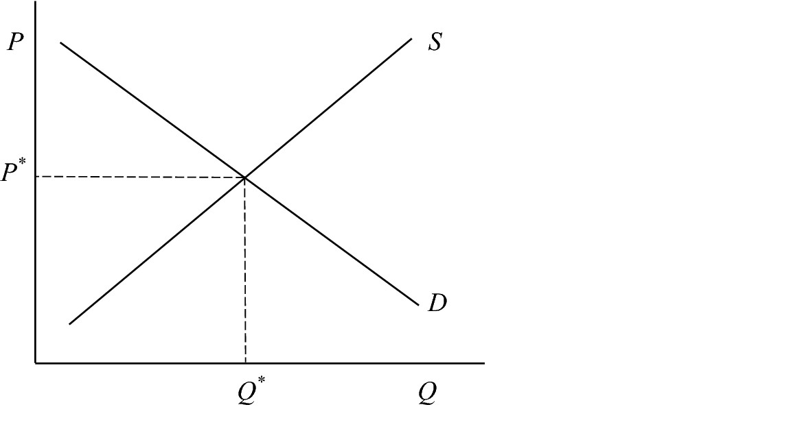
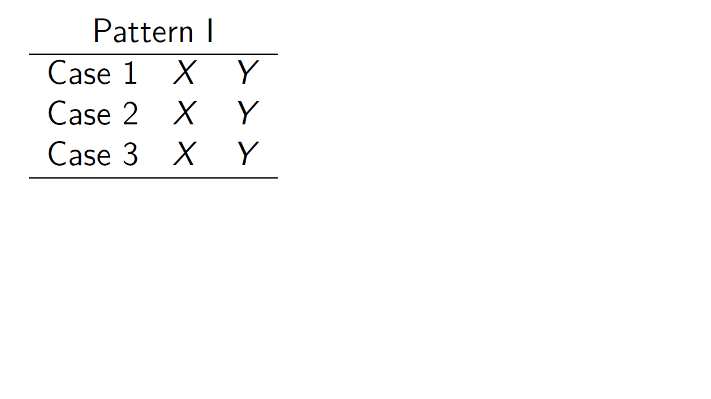
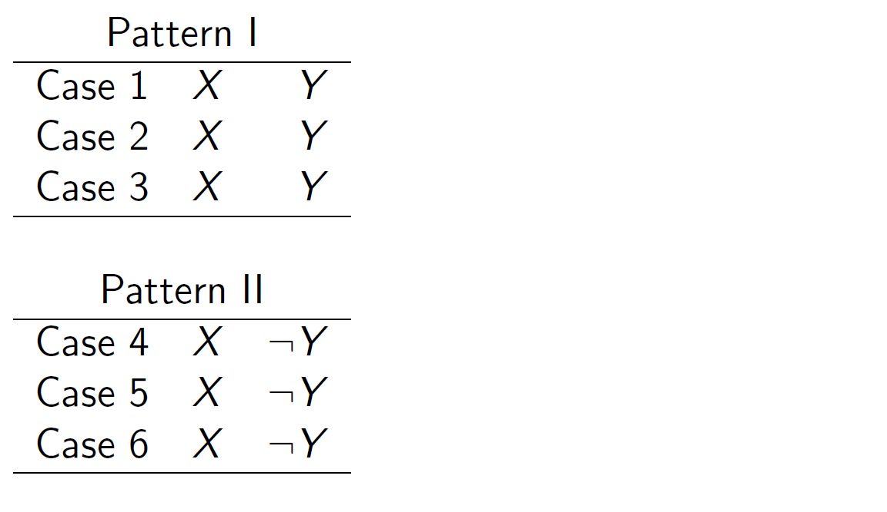
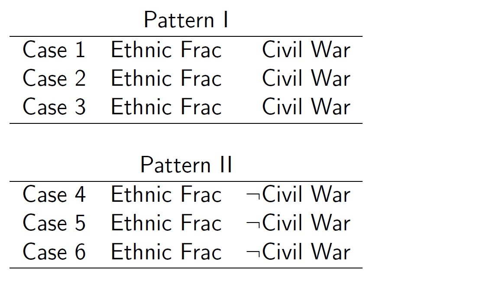

```{r  setup, message=FALSE, warning=FALSE, include=FALSE}
options(
  htmltools.dir.version = FALSE, # for blogdown
  width = 80,
  tibble.width = 80
)

knitr::opts_chunk$set(
  fig.align = "center",  warning=FALSE, message=FALSE
)

library(kableExtra)
library(tidyverse)
library(magrittr)


```

## Agenda

- Theory

- Case selection

    - Selecting on the dependent variable

    - Selecting on the independent variable

- Case selection strategies
---
class: inverse, middle, center
# Theory

---

## What is Theory?

- A series of statements that organize thinking to explain (and predict) patterns in the data.

- Consists of broad generalizations together with a set of assumptions or axioms and definitions of concepts

- Simplifies reality

- Explains facts and occurrences in a generalizable way 

- A theory provides an explanation of what to expect to see....or to not see
---
## Example: Price Theory


```{r, echo=F, out.width= "600px",fig.align="center"}

```

- What are the assumptions of this theory? 

- Are they true?

- Is this a useful theory?

---
## Example 1: Absentmindedness

- Your professor has forgotten to bring last week’s homework. They apologize, and you turn to the person next to you and say, “what can you expect
from absent-minded professors?”

- This is your explanatory model for the professor’s behavior. This is a common--but poor--model. Where is the process or causal
mechanism? One way to identify process is to ask why are professors absent-minded.

---
## Example 1: Absentmindedness

*Model 1* (Prioritization): Individuals have a limited amount of time to accomplish their tasks. Tasks have different priorities. Busy people have to prioritize their tasks based on importance. The professor does not consider teaching important, and so they did not bother to go to their office and find the homework papers. 

  - *Hypothesis*: Professor is less forgetful at tasks to which they assign higher importance (e.g., graduate classes, research).

*Model 2* (Concentration): One becomes a professor by learning to be a good problem solver. Good problem solving involves almost single-minded concentration. So the professor occasionally forgets to do one thing, because they are concentrating on another.

  - *Hypothesis*: Professor is less forgetful at tasks they are currently working on and more forgetful when they switch among tasks.

---
## Example 2: Student Riots

- An introductory social science class was asked to develop theoretical models that explain protests and riots by college students. Below are 3 answers provided by students. Let’s evaluate them.

---
## Answer 1

- *Model 1*: People resent being told what to do and will express this resentment if they get a chance. College students are told how to run their lives by both their parents and college authorities, and both parents and authorities use various kinds of threats to prevent the expression of resentment; the recent
change to permissive regulations at colleges gives students a chance to express resentment.

- *Test*: Distribute a questionnaire among college students and ask them if they resent being told what to do. You could also ask parents if their use threats to control behavior.

---
## Evaluation 1

- *Grade*: B

- Though the theory is fine, the tests are poor.

    - We want to test implications, not assumptions.

    - Assumptions are sometimes unreasonable (recall price theory), and not directly observable.

- Questionnaires tell you why people believe (or to claim to believe) something, not whether that belief is true.

- How to improve? Look for natural instances in which these two key variables vary (regulations and protest participation).

    - Colleges vary in terms of strictness and penalties
    
    - Variation in student sensitivity to penalties

---
## Answer 2

- *Model 2*: People become unreasonable when they are frustrated. Attempts by college students to make changes are usually ignored or postponed by college administrators.

- *Test*: Examine the record of student riots on many campuses to
see if the model is true.

---
## Evaluation 2

- *Grade*: B

- Theory is reasonable, but the test is vague.

- How to improve? Add more specification:

    -Less student unrest on campuses where student-led change was successfully carried out.

---
## Answer 3

- *Model 3*: Taxpayers make great sacrifices to provide free or low cost education for students. People only value what they pay
for. Since tuition and loans are cheap and easily accessible, students are willing to disrupt their education by protesting. 

- *Test*: Compare students that do not have loans and pay directly for their tuition to those that do not pay directly for their education. Can also compare the number of protests at colleges with varying levels of tuition.

---
## Evaluation 3

- *Grade*: A

- This is an excellent theory and test.

---
## Your Turn

- *Observation*: Friends tend to live on the same floor or even be roommates.

- Propose a model that explains this observation.

- Derive a testable implication.

---
## Group Exercise

- In groups of 4:

  - Present the theoretical model you developed for your research project
  
  - Give each other feedback on:
  
      - Does this theory posit a causal mechanism (explains why $X$ causes $Y$ rather than just posits it)?
      
      - Is the theory general? (Busy people prioritize their tasks rather than Professor Olga prioritizes her tasks)
      

---
class: inverse, middle, center
# Case Selection
---

## Selection on the Dependent Variable


- Looking at cases where the outcome of interest does not vary

    - What problems arise from selecting on the dependent variable

---

## Selection on the Dependent Variable

Many look at event of interest Y to see if common cause X

```{r, echo=F, out.width= "1000px",fig.align="center"}

```

---
## Selection on the Dependent Variable

- The problem is that it may be that $X$ occurs even when $Y$ does not

- This problem arises if we select cases based on the dependent variable, that is, we only look at $Y$ but not $\neg Y$ .
 
```{r, echo=F, out.width= "1000px",fig.align="center"}

```


---
## Example 

```{r, echo=F, out.width= "1000px",fig.align="center"}

```

---
## Case Selection Strategies

- Most similar cases

- Definition: cases that are similar on all factors except $X$

- Goal: isolate the causal effect of $X$ on $Y$

- Strategy: hold all else equal, but the key explanatory variable 

---
## Your Turn

Jay is a recent U of T graduate working in the Ministry of Education. Correlating data on technology usage and education among primary students in Ontario, they found a negative relationship between screen time and test scores.


- Should the government base policy on this research? 

- What case selection strategy did Jay employ?

- How can Jay improve their research design?

---
## Groups Exercise

- In groups of 4:

  - Present the research design you developed for your research project
  
      - What is the level of analysis (e.g., county, country)?
      
      - What is the treatment? What is the outcome?
  
  - Give each other feedback on:
  
      - Is the treatment exogenous? That is, can the outcome cause the treatment?
      
      - Are the treatment and control group comparable on all variables other than the treatment?
      
      - Do you have enough observations to calculate the means of each group?


