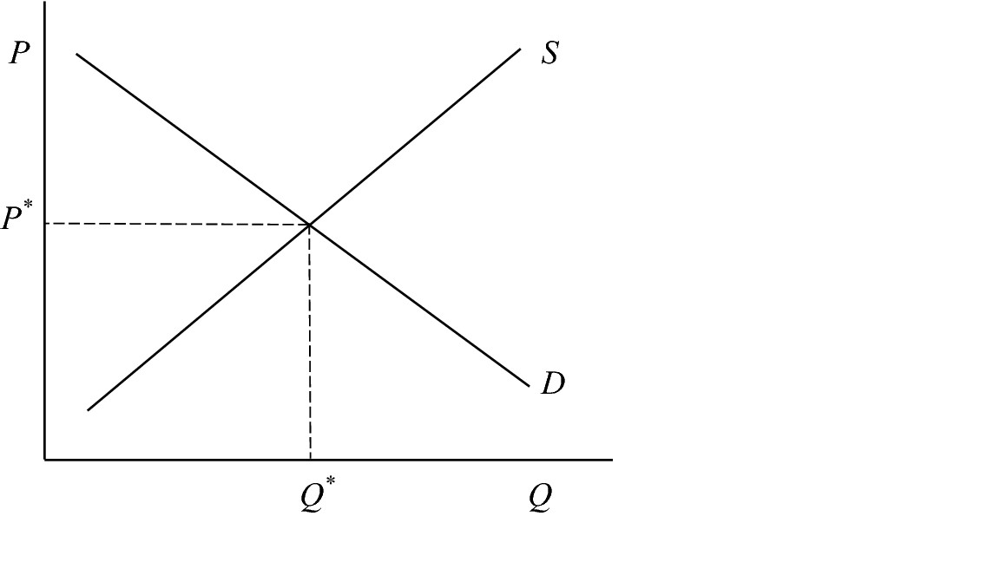
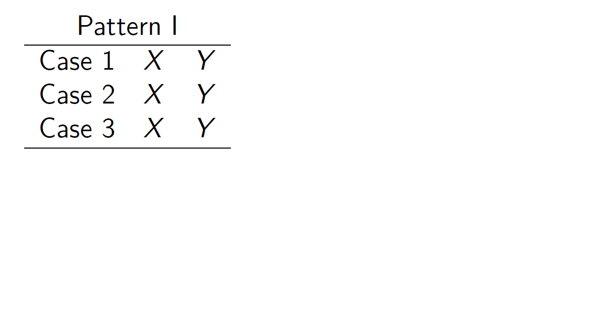
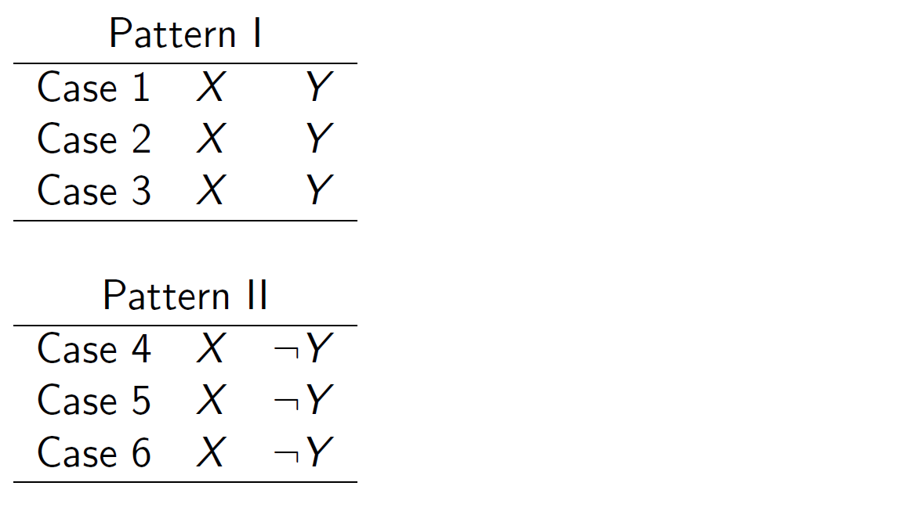
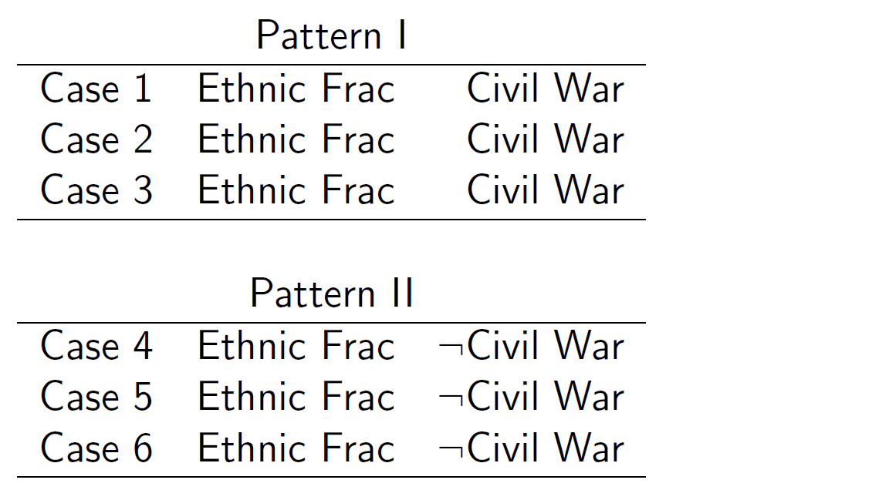

```{r  setup, message=FALSE, warning=FALSE, include=FALSE}
options(
  htmltools.dir.version = FALSE, # for blogdown
  width = 80,
  tibble.width = 80
)

knitr::opts_chunk$set(
  fig.align = "center",  warning=FALSE, message=FALSE
)

library(kableExtra)
library(tidyverse)
library(magrittr)


```

## Agenda

- Research Question

- Theory and Hypothesis

- Case selection

    - Selecting on the dependent variable

    - Selecting on the independent variable

- Case selection strategies
---
class: inverse, middle, center
# Research Question

---
## Research Question

Remember that a research question is general, it does not name specific places or policy areas. Also note that a research question must be open-ended, it is not a yes/no question.

- What are the causes of poverty?

- What is the relationship between indiscriminate attacks and civilian violence?

- Your Turn.

---
class: inverse, middle, center
# Theory

---

## What is Theory?

- A series of statements that organize thinking to explain (and predict) patterns in the data.

- Consists of broad generalizations together with a set of assumptions or axioms and definitions of concepts

- Simplifies reality

- Explains facts and occurrences in a generalizable way 

- A theory provides an explanation of what to expect to see....or to not see
---
## Example: Price Theory


```{r, echo=F, out.width= "600px",fig.align="center"}

```

- What are the assumptions of this theory? 

- Are they true?

- Is this a useful theory?
---
## Theory-Building

- Start with something you know.

- Think of a logical explanation.

- Derive a novel prediction (something else that must be true if your theory is true)--that is your hypothesis.

---
## Example 1: Grad School Applications

- The quality of graduate applications decreases as the deadline approaches.

- Where is the process or causal mechanism? 

---
## Example 1: Grad School Applications

*Model 1* (Time Management): Students who delay are less prepared or organized. These students may underestimate the time needed to revise essays, request letters of recommendation, or navigate submission portals. As a result, last-minute applications may suffer from incomplete proofreading, weak coherence, or underdeveloped personal statements—not due to weaker ability, but due to poor execution.

  - *Hypothesis*: Late applicants will also tend to have last-minute recommendation letters.

*Model 2* (Selection Model): Application timing reflects underlying applicant quality: stronger, more confident applicants submit early, while weaker applicants delay. In contrast, weaker applicants may delay in hopes of improving their application, scrambling to raise test scores, secure recommenders, or polish materials they feel are not yet competitive.

  - *Hypothesis*: GPA/test scores of early applicants will be higher on average.


---
## Your Turn

- *Observation*: Civil wars happen in poor countries.

- Propose a model that explains this observation.

- Derive a testable implication.

---
## Your Turn

  - Write down something your know about your research topic.
  
  - Think of theoretical model that explains this observation.
  
  - What else must be true if your theory is true--that is your hypothesis.
      
---
class: inverse, middle, center
# Hypothesis

---
## Hypothesis

A hypothesis is a causal statement of the form: "As X increases[decreases], Y increases[decreases]."

- Your Turn.

---
class: inverse, middle, center
# Case Selection
---

## Selection on the Dependent Variable


- Looking at cases where the outcome of interest does not vary

    - What problems arise from selecting on the dependent variable

---

## Selection on the Dependent Variable

Many look at event of interest Y to see if common cause X

```{r, echo=F, out.width= "1000px",fig.align="center"}

```

---
## Selection on the Dependent Variable

- The problem is that it may be that $X$ occurs even when $Y$ does not

- This problem arises if we select cases based on the dependent variable, that is, we only look at $Y$ but not $\neg Y$ .
 
```{r, echo=F, out.width= "1000px",fig.align="center"}

```


---
## Example 

```{r, echo=F, out.width= "1000px",fig.align="center"}

```

---
## Case Selection Strategies

- Most similar cases

- Definition: cases that are similar on all factors except $X$

- Goal: isolate the causal effect of $X$ on $Y$

- Strategy: hold all else equal, but the key explanatory variable 

---
## Your Turn

Jay is a recent U of T graduate working in the Ministry of Education. Correlating data on technology usage and education among primary students in Ontario, they found a negative relationship between screen time and test scores.


- Should the government base policy on this research? 

- What case selection strategy did Jay employ?

- How can Jay improve their research design?

---
## Data and Methods
Describe the data will you use to answer your question. [1-2 sentences to answer each of
the following] 

- Where will you obtain the data (e.g., website)?

- What is your sample (temporal and geographical scope)? 

- What is the level of analysis (e.g., county, country)?
      
- What is the treatment? What is the outcome?

- How will you measure your independent and dependent variable?

      - Is the treatment exogenous? That is, can the outcome cause the treatment?
      
      - Are the treatment and control group comparable on all variables other than the treatment?
      
      - Do you have enough observations to calculate the means of each group?


