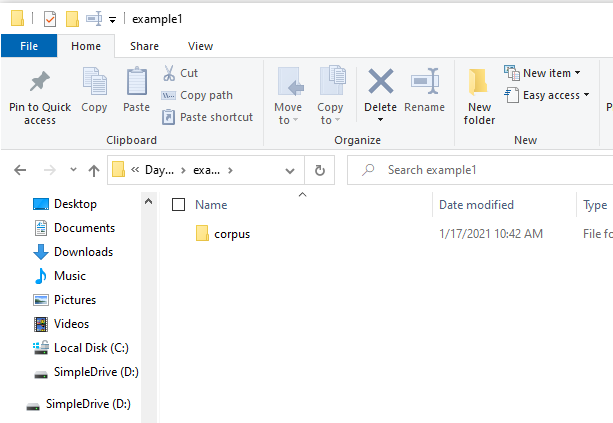
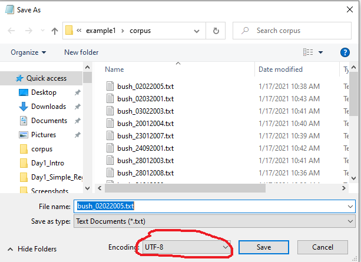
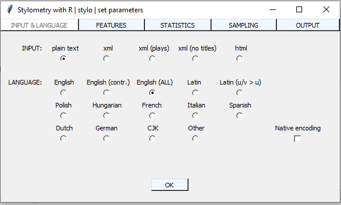
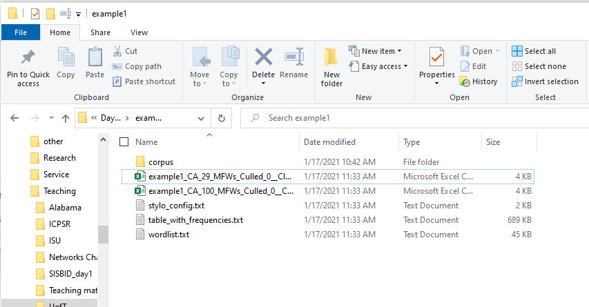
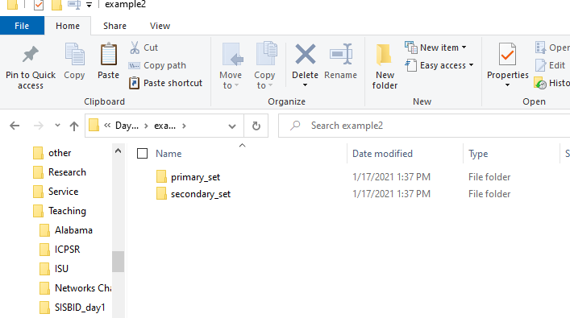
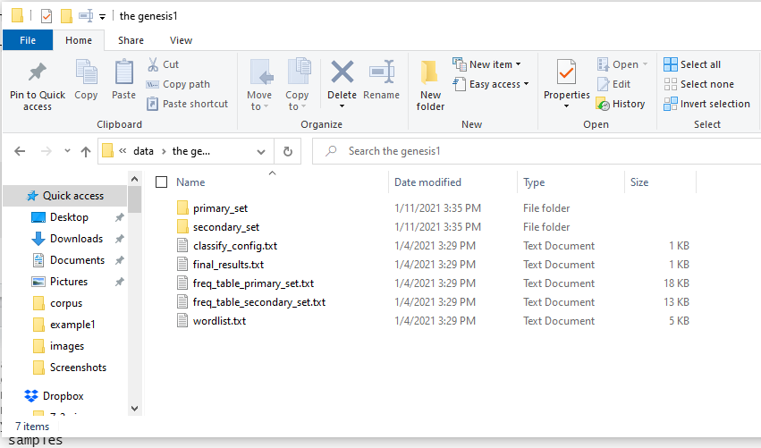

```{r  setup, message=FALSE, warning=FALSE, include=FALSE}
options(
  htmltools.dir.version = FALSE, # for blogdown
  width = 80,
  tibble.width = 80
)

knitr::opts_chunk$set(
  fig.align = "center",  warning=FALSE, message=FALSE
)

```

## Text Analysis

Assigned Reading: Jodie Archer and Matthew L. Jockers. The Bestseller Code: Anatomy of the Blockbuster
Novel. St. Martin's Publishing Group, 2016. Chapter 4.

---
## Text Analysis

- What is the book that everybody is reading now? 

---
## Text Analysis

- What is the "linguistic DNA"? What features of writing make up this DNA, according to the chapter?  Are there other features that must be accounted for?

- What aspects of text are analyzed by stylometrists?

- Why does it matter how often a book uses the word "the"? What concept does this measure capture?  Is it convincing?

- How can the number of commas predict whether a book becomes a best-seller?

- Why are women-authors more likely  to use the "best-seller" writing style?

- How does the model work?
---

## Cont'd

"In fact, using only the
491 most frequently occurring words and marks of punctuation, the
machine was able to differentiate between bestselling books and nonbestselling
books 70 percent of the time. Using only 148 features, the
machine guessed correctly 68 percent of the time, and this was just using
the most common filler words and punctuation: no nouns, no adjectives, no
verbs, no syntax, no sentence data." 

- What is the value added of those `r 491-148` features?

- So can one use this formula to get on the NYT best seller list? How?

- If you can count the commas to measure style, can you remove/insert commas to create style?

- How can we apply the concept of model fit to help us make sense of the book's findings?

- How can we apply this to the study of political science?

---
## Example 1

We will analyze the transcripts of Bush's and Obama's [State of the Union addresses](https://www.govinfo.gov/features/state-of-the-union).

Download/unzip the file "corpus" from Quercus (this folder must be named "corpus" for the software to work).

---

## Prepare the data

Save the unzipped directory `corpus` **in your current working directory**.

```{r, echo=F, out.width= "800px",fig.align="center"}

```

---
## Prepare the data

The `corpus` directory contains the transcripts of the State of the Union addresses (.txt format, encoding UTF8 preferred).

```{r, echo=F, out.width= "600px",fig.align="center"}

```

---
## Using `stylo`

```{r, echo=T,  eval=F}
install.packages("stylo")
library(stylo)
myanalysis<-stylo()

```

---

```{r, echo=F, out.width= "800px",fig.align="center"}

```

---
## Results

```{r, echo=F, out.width= "1400px",fig.align="center"}

```
---
## Look at the Output

```{r}
mydata<-read.table("./data/example1/table_with_frequencies.txt", header=TRUE)
mydata
```


---

## Analyse the Output

Suppose we would like to compare the linguistic DNA of the two Presidents.

- Compare average usage of the word `the`:

```{r}
mean(as.numeric(mydata['the',1:9])) #Bush
mean(as.numeric(mydata['the',10:19])) #Obama
```

- Compare average usage of the word `and`:

```{r}
mean(as.numeric(mydata['and',1:9])) #Bush
mean(as.numeric(mydata['and',10:19])) #Obama
```

---
## So What?

- How can you use this tool to learn answers of relevance to political science?

- What assumptions need to hold in order for us to interpret these answers in causal terms?


---
## Your Turn

1. Test whether Bush uses the word "economy" more/less than Obama.

2. Test whether Bush uses the word "security" more/less than Obama.

```{r, echo=F, eval=F}
mean(as.numeric(mydata['economy',1:9])) #Bush
mean(as.numeric(mydata['economy',10:19])) #Obama

mean(as.numeric(mydata['security',1:9])) #Bush
mean(as.numeric(mydata['security',10:19])) #Obama
```

---

## Example 2: The Documentary Hypothesis

The "documentary hypothesis" posits that the Pentateuch, the first five books of the Jewish and Christian bibles
(Genesis, Exodus, Leviticus, Numbers, Deuteronomy), were not written by Moses, the
traditional author, but are in fact a combination of various anonymous sources: the Yahwist (J),
the Elohist (E), the Deuteronomist (D), and the Priestly (P).


---

## Using `stylo` to  Test the Documentary Hypothesis

- In addition to counting words, the package `stylo` also allows for identifying the authorship of text.

- We will apply this function to test the "documentary hypothesis" .

- Download and set-up the data, set your directory to the one that contains these folders:

```{r, echo=F, out.width= "1400px",fig.align="center"}

```

---
## The Data

I saved 5 different excerpts from Genesis:

- 2 excerpts hypothesized to be written by J (J.txt, j.txt);
- 2 excerpts hypothesized to be written by E (E_G22_1_19.txt, e.txt);
- 1 excerpt that is hypothesized to have been authored by E or J.

The `primary_set` directory contains text files with known authors.

The `secondary_set` directory contains text files whose authorship we have to attribute.


---


## Use `stylo::classify`

```{r, eval=F}
genesis<-classify()
summary(genesis)
genesis$distance.table
```

```{r, echo=F, out.width= "1400px",fig.align="center"}

```

---
## Interpret the Distance Table

| |         E |       J|
|-- |-----------|---------|
|e |1.597276| 2.044529|
|j | 2.149624| 2.114899|
|x |1.847896 |2.037398|

- Smaller distance indicate likely the same author

- Who is more likely to be the author of passage x?

---
## Your Turn

- Set up the data and make the distance table for Bush's and Obama's speeches. What speeches will you use in the training set? What does this distance table show?


