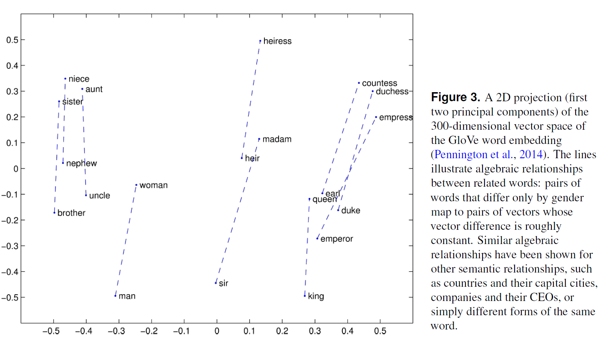
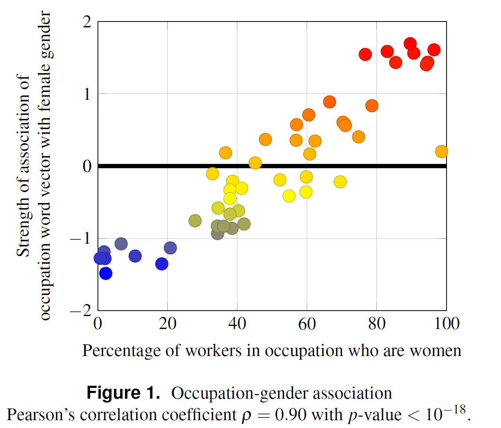

```{r  setup, message=FALSE, warning=FALSE, include=FALSE}
options(
  htmltools.dir.version = FALSE, # for blogdown
  width = 80,
  tibble.width = 80
)

knitr::opts_chunk$set(
  fig.align = "center",  warning=FALSE, message=FALSE
)

```

## Assigned Readings

- Danah Boyd and Kate Crawford. 2011.*Six Provocations for Big Data. *A Decade in Internet
Time: Symposium on the Dynamics of the Internet and Society.* 

- David Lazer et al.2014. *The Parable of Google Flu: Traps in Big Data Analysis.* 

- Aylin Caliskan, Joanna J. Bryson, and Arvind Narayanan. 2017. Semantics Derived Automatically from Language Corpora Contain Human-Like Biases. *Science* 356(6334):183--186,

- Jevin D. West. 2010. How to Improve the Use of Metrics: Learn from Game Theory. *Nature* 465(17):870--872.


---
## Type of Scientific Inference

- Deduction: “top-down” reasoning whereby, if the premises are held to be true (and the terms in
use precisely specified), then the conclusion follows as a logical necessity, based on the reductive application of
laws to a closed domain of discussion.

   - Example. The Earth is round and revolves around the Sum. Therefore, the Sun rises in the East.

- Induction: “bottom-up” reasoning, whereby a conclusion is reached via generalization or extrapolation from initial information. 

   - Examples:  The Sun rose in the East yesterday and today. Therefore, the Sum must always rise in the East.

- Is Big data more amenable to deductive or inductive inference?
---


## Induction to the Extreme

"This is a world where massive amounts of data and applied mathematics replace every other tool that might be brought to bear. Out with every theory of human behavior. [...] Who knows why people do what they do? The point is they do it, and we can track and measure it with unprecendented fidelity. With enough data, the numbers speak for themselves."

                                                         -- Anderson (2008)

--

Is this praise or a critique?

--

Do numbers speak for themselves?
---

## Discussion Questions

- What is Big Data? What is Small Data?

- What are the unique challenges of analyzing Big Data?

- In what way are the "four forces"---the market, the law, social norms, and code---at odds when it comes to Big Data?

???
- Market: The market sees Big Data as pure opportunity: marketers use it to target advertising, insurance providers want to optimize their offerings, and Wall Street bankers use it to read better readings on market temperament (Boyd and Crawford, 2). 

- Law: Legislation has already been proposed to curb the collection and retention of data, usually over concerns about privacy (Boyd and Crawford, 2).

- Norms: Features like personalization allow rapid access to more relevant information, but they present difficult ethical questions and
fragment the public in problematic ways (Boyd and Crawford, 2).

- Code: Social and cultural researchers have a stake in gaining access.


---
## A New Definition of Knowledge?

- What are the parallels between Fordism and Big Data? Is this a good thing?

- Do Big Data dictate what questions we ask?  Why?  Does it have to?  Consider your choice of question for Assignment 2 as an example.
???

- Ford's innovation was using the assembly line to break down interconnected, holistic tasks into simple, atomized,
mechanistic ones. He did this by designing specialized tools that strongly predetermined and limited the action of the worker. Similarly, the specialized tools of Big Data also
have their own inbuilt limitations and restrictions (Boyd and Crawford, 4).
---

## Objectivity and Accuracy

- Are Big Data biased?  In what way?  Why? Do biased data lead to biased answers? Do unbiased data lead to unbiased answers? How can you get unbiased answers from biased data?

- Why are Big Data and "whole data" not the same?  What are the implications?

- Under what conditions does Bigger Data mean better data? When does it not?

- What measurement issues should a Big Data scientist watch out for (vs. a small data scientist)?

- What is the [IAT test](https://implicit.harvard.edu/implicit/selectatest.html)? What is the Word Embedding Association Test (WEAT)?

???
Roughly, for each word, its relationship to all other
words around it is summed across its many occurrences in a text. We can then measure the distances (more precisely, cosine
similarity scores) between these vectors. The thesis behind word embeddings is that words that are closer together in the vector
space are semantically closer in some sense. Thus, for example, if we find that *programmer* is closer to *man* than to *woman*, it
suggests (but is far from conclusive of) a gender stereotype.

---

```{r echo=FALSE, out.width='200%'}

```

---

## Caliskan et al (2017)

- What corpora do Caliskan et al (2017) use? What evidence of Big Data bias do they find?

- How can we reduce these biases?

---
## Why is This a Problem?

```{r echo=FALSE, out.width='80%'}

```

---
## Ethical Research

- What is the balance between data transparency and privacy?

- How can we anonymize the data while preserving its usability?

- Should public data be fair game? Under what conditions?

- What is research accountability?

- What is the "new digital divide"?
---
## Google Flu Tracker

- How can Google searches predict flu cases?

- What are the similarities between GFT and the model used in the "Bestseller Code"?

- Why did GFT miss the 2009 H1N1 pandemic?

- What is "big data hubris"? 

- How did GFT fare on research transparency and reproducibility?

- How can we use the lessons from GFT failure to improve predicting trends moving forward?
???

“Big data hubris” is the often implicit
assumption that big data are a substitute
for, rather than a supplement to, traditional
data collection and analysis.


---

## Lessons from Game Theory

- What is the problem described in the article?  What recommendations did it suggest for addressing it?  Does the problem/solutions apply beyond the academe, e. g., venture capitalism, industry, government? 

- How can we apply the strategies proposed in the article to help improve the quality of Big Data research?


---

## Using Correlations to Specify a Model

- Download the [Global Terrorism Dataset](https://www.start.umd.edu/gtd/access/) and its codebook from the course website.

- Load the data (I recommend using function `fread` from the `data.table` package to speed up loading).

```{r, eval=T}
#install.packages("data.table")
library(data.table)
mydata<-fread("./data/GTD_data_small.csv", header=TRUE)
cor(mydata$nkill,mydata$iyear, use="complete.obs")

```


---
## Your Turn

- Use the `cor` function to find the top 10 variables correlated with `nkill`. See `?cor` for help.

- Regress `nkill` on the variables you identified (use the `lm` function).

- What is the $R^2$ of your model?  What does this model tell you about the number of casualties in terrorist attacks?

---

## Discussion

- Regress *nkill* of the variables with the highest correlation to it:

 
```{r, echo=F}
m1<-lm(nkill~ nwound+nkillus+ nkillter+ nhostkid+ nreleased+ nwoundte+suicide, data=mydata)
summary(m1)
```


