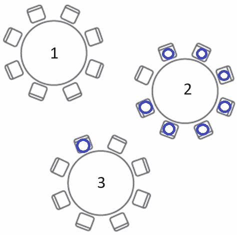
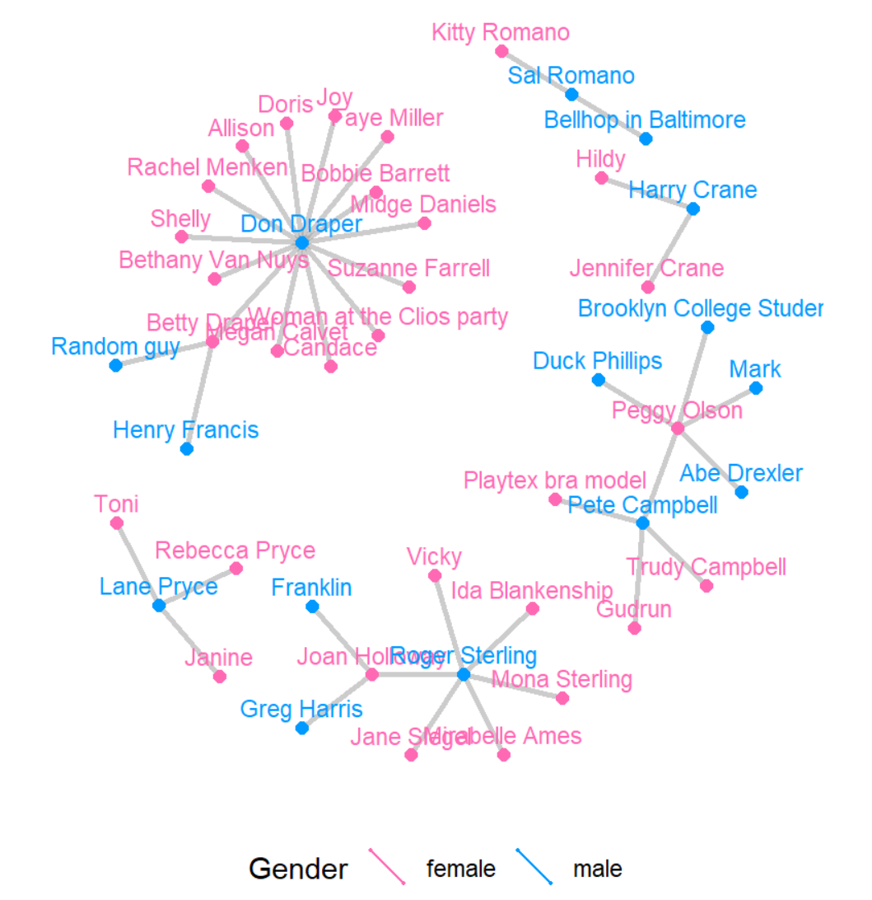
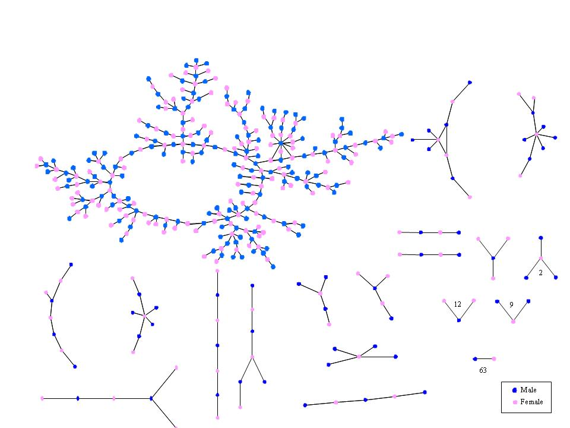
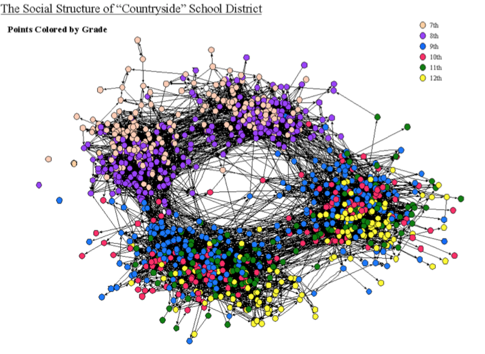
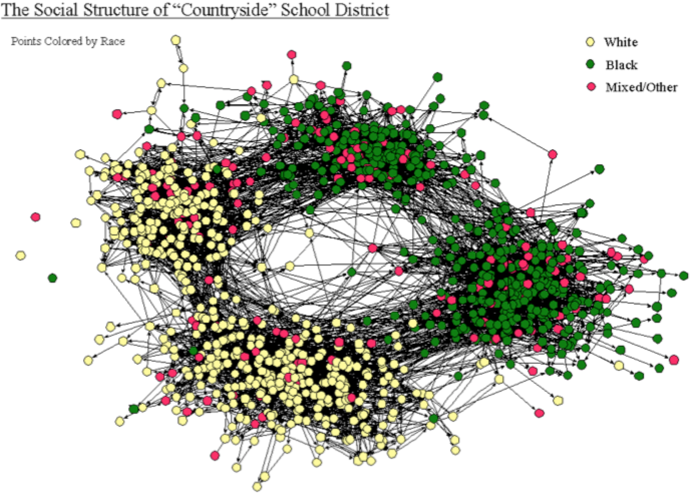
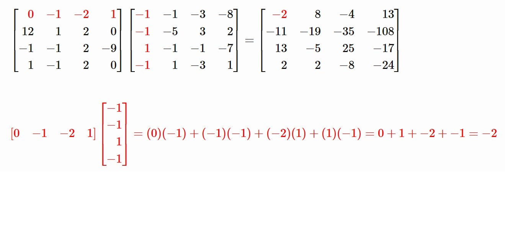

```{r  setup, message=FALSE, warning=FALSE, include=FALSE}
options(
  htmltools.dir.version = FALSE, # for blogdown
  width = 80,
  tibble.width = 80
)

knitr::opts_chunk$set(
  fig.align = "center",  warning=FALSE, message=FALSE
)

```

## Today's Class

 1. Definitions. What is network analysis?
 
 2. Network data
 
 3. Network features and measurements
 
 4. An application: modeling contagion

---

## Would You Win $1,000,000?

Suppose you are playing the following game:

If you can get all your friends to meet you at the entrance to the ROM in exactly 1 hour, you will win $1,000,000. The catch is that you can only contact one friend, and not all your friends know each other. Which friend would you call and why?

---

| Sender | Receiver |
|----------|----------|
| 1    | 2, 3   |
| 2    |1, 3, 4, 5   |
| 3    | 1, 2, 4, 5  |
| 4    |2, 3, 5, 7  |
| 5    | 2, 3, 4, 6, 7   |
|6     |5, 7, 8   |
|  7    | 4, 5, 6   |
| 8    |6, 9, 12   |
|9    | 8, 10   |
| 10   |9  |
| 11   | 12  |
| 12   | 8, 11, 13, 14, 15, 16  |
| 13   | 12 |
| 14   | 12 |
| 15   | 12 |
| 16   | 12 |

---
## Visualization of the Friends Network


```{r, echo=FALSE, eval=TRUE, message=FALSE, out.width='600px', fig.align='center'}
library(igraph)
library(sna)
el <- matrix( c("1", "2",
                "1", "3",
                "2","3",
                "3","5",
                "2","4",
                "2","5",
                "3","4",
                "4","5",
                "4","7",
                "6","5",
                "5","7",
                "6","7",
                "6","8",
                "8","9",
                "9","10",
                "8","12",
                "11","12",
                "12","13",
                "12","14",
                "12","15",
                "12","16"), nc = 2, byrow = TRUE)
g<-graph_from_edgelist(el, directed=F)
set.seed(1598)
plot(g,  edge.arrow.size=1, edge.color="black", vertex.color="white")

```
 

```{r, eval=F, echo=F}
sim_spread<-function(g, p0) {

neighbors1<-names(neighbors(g,p0))

mynet<-as.matrix(igraph::as_adj(g))
mynet2<-mynet%*%mynet
diag(mynet2)<-0 #a node cannot be connected to itself
neighbors2<-names(mynet2[p0,][mynet2[p0,]>0])
neighbors2

mynet3<-mynet2%*%mynet
diag(mynet3)<-0 #a node cannot be connected to itself
neighbors3<-names(mynet3[p0,][mynet3[p0,]>0])

V(g)$color <- ifelse(V(g)$name %in% neighbors3, "red1", "gray97")
V(g)$color[V(g)$name %in% neighbors2]<- "red2"
V(g)$color[V(g)$name %in% neighbors1]<- "red3"
V(g)$color[V(g)$name == p0]<- "red4"
set.seed(1598)
plot(g)


V(g)$color <- ifelse(V(g)$name %in% neighbors2, "red2", "grey")
V(g)$color[V(g)$name %in% neighbors1]<- "red3"
V(g)$color[V(g)$name == p0]<- "red4"
set.seed(1598)
plot(g)


V(g)$color <- ifelse(V(g)$name %in% neighbors1, "red3", "grey")
V(g)$color[V(g)$name == p0]<- "red4"
set.seed(1598)
plot(g)

V(g)$color <- ifelse(V(g)$name == p0, "red4", "grey")
set.seed(1598)
plot(g)

}

sim_spread(g, "12")
```

---
## Discussion

- What criterion helps spread the message in the fewest possible steps?

- What are social science applications of this game?

---

## Why Do We Need Network Analysis?
Suppose you walked into a dining room that hosts a luncheon at a conference you are currently attending. What table would you sit at?

```{r, out.width= "400px",fig.align="center", echo=FALSE}

```


---
class: inverse, middle, center

# Network Analysis: Formal Definitions

---

## What is a network (i.e., a graph)?

A set of **nodes** and **relation(s)** defined on them

```{r, out.width= "400px",fig.align="center", echo=F}

```
---

## Defining a Network: What's a node?

- A <span style="color:DarkCyan">**node**</span> can be defined as an entity that can form relations with other entities. 

**Synonyms**: 

- actor: from sociometry, common terminology in sociology and psychology
- vertex: from graph theory (i.e., math), common terminology in mathematics and physics

Term node is common in statistics and applied sciences outside of soc and psych.
---
## Examples of Nodes

- Individuals (Mad Men characters, legislators, terrorists)

- Families 

- Organizations, Human Rights NGOs

- Countries
---
## Defining Network: What's a tie? 

- A <span style="color:DarkCyan">**relation/tie**</span> defines the existence of an attribute relating nodes. 

**Synonyms**: 

- link: common in computer science (e.g., huge lit on “Link Prediction”) and social sciences
- edge: graph theoretic terminology common in physics and math, but also elsewhere

**Ties can have characteristics**: 

- Weight
- Qualitative attributes
- Direction
---
## Examples of Ties

- Romantic relationship, marriage, friendship

- Business relationship

- Cooperation/conflict
---

## Network graphs can reveal important structures


```{r, echo=FALSE,out.width="49%",out.height="10%",fig.cap=" ",fig.show='hold',fig.align='center'}
knitr::include_graphics(c("images/p1.png","images/p2.png"))
``` 
---
## Adolescent romantic and sexual networks  

```{r, echo=FALSE, out.width= "600px",fig.align="center"}

```
**Bearman, Moody and Stovel**
---
## Adolescent Social Structure by **Jim Moody**
```{r, echo=FALSE, out.width= "600px",fig.align="center"}

```

---
## Adolescent Social Structure by **Jim Moody**
```{r, echo=FALSE, out.width= "600px",fig.align="center"}

```

---
class: inverse, middle, center

# Other Important Definitions


---
## An Adjacency Matrix 
Network data are often stored in the form of *adjacency matrices* whose $ij^{th}$ element represents the relationship between nodes $i$ and $j$.

```{r, echo=F}
library(igraph)
library(network)
data(flo)
as.matrix(flo)[1:16,1:6]
```

---

## Network Measures: Centrality


- Centrality measures help understand:

  + **"Which node is the most important or central in this network?"**
  
  + What do you mean by "important"?
  
  + What do you mean by "center"?
  
  + Definition of "center" varies by context/purpose
    
    + The power a person holds in an organization may be inversely proportional to the number of keys on their keyring 
      
      + A janitor has keys to every office, and no power
      
      + The CEO does not need a key: people always open the door for her
---

## Florentine Families

Who looks central? 

```{r, echo=FALSE, eval=TRUE, out.width='500px', fig.align='center'}
library(igraph)
library(network)
data(flo)
g = graph_from_adjacency_matrix(flo, mode='undirected', diag=FALSE)
set.seed(6886)
plot(g, vertex.size=1,vertex.color="black")
```

---
## Network Measures: Degree Centrality

- **Idea**: The nodes with more connections to others are more central

- How to  measure: node $i$'s degree is the sum of its direct ties.

- Though simple, degree is often a highly effective measure of the influence or importance of a node
  
  + In many situations, people with more connections tend to have more power


- Examples where this might be useful? 

---

## Florentine Families: an Adjacency Matrix

How would you calculate Albizzi's degree centrality?
```{r, echo=F}
as.matrix(flo)[1:16,1:6]
```


---

## Network Measures: The Shortest Path

- The (geodesic) distance: $d_{i,j}$ is the minimal path length from $i$ to $j$.

- Example: Can identify and count all nodes within the shortest path of $2$ from *i*

- Useful for modeling contagion, or spread of information.

---

## The Shortest Path: Calculation

Let $A_{ij}$ represent the adjacency matrix associated with a network of interest. It turns out that the $ij^{th}$ element of $A^2$ will give you the number of the shortest paths of length 2 between $i$ and $j$.

.pull-left[

$A$
```{r, echo=F}
A<-as.matrix(flo)[1:10,1:10]
dimnames(A) <- list(c(1:10), c(1:10))
A
```
]

.pull-right[
$A^2$
```{r, echo=F}
A2<-A%*%A
diag(A2)<-0
A2
```
]

---

## Matrix Multiplication Refresher

```{r, echo=FALSE, out.width= "800px",fig.align="center"}

```

---
class: inverse, middle, center
# Lab: A Network Model fo Contagion


---
## Example: High-School Friendships


1. Open and explore the data

2. Notice that the data contain 2 waves (fall and spring), each stored as an adjacency matrix.

```{r}
library(sna)
data(coleman)
coleman[1,1:10,1:10]
```


---
## Make a Network Visualization

Convert to an `igraph` object:

```{r, out.width='500px', fig.align='center'}
library(igraph)
ggraph<-graph_from_adjacency_matrix(coleman[1,,], mode="undirected", diag=FALSE)
plot(ggraph, vertex.color="black", vertex.size=5, vertex.label=NA)
```

---
## Calculate Degree Centrality for Each Node

```{r}
degree.cent <- igraph::degree(ggraph)
degree.cent
```


---

## Visualize Information Spread

1. Select the first individual to share the information with (the seed).

2. Color the seed node red. 

```{r, out.width='400px', fig.align='center'}
V(ggraph)$color <- ifelse(V(ggraph)$name == 21, "red", "grey")
plot(ggraph)
```

---

## Shortest Path of 1

```{r, out.width='300px', fig.align='center'}
neighbors(ggraph,21)
V(ggraph)$color <- ifelse(V(ggraph)$name %in% neighbors(ggraph,21), "pink", "grey")
V(ggraph)$color[V(ggraph)$name == 21]<- "red"
plot(ggraph)
```


---

## Shortest Path of 2

1. Convert `ggraph` to an adjacency matrix, A.

2. The elements of $A^2$ will give you the number of shortest paths of length 2 between $i$'s and each other node.

3. Select nodes that have 1 or more shortest path of length 2 to node 21.

```{r, out.width='400px', fig.align='center'}
mynet<-as.matrix(igraph::as_adj(ggraph))
mynet2<-mynet%*%mynet
diag(mynet2)<-0 #a node cannot be connected to itself
neighbors2<-names(mynet2[21,][mynet2[21,]>0])
neighbors2
```

---
```{r, out.width='600px', fig.align='center'}

V(ggraph)$color <- ifelse(V(ggraph)$name %in% neighbors2, "mistyrose", "grey")
V(ggraph)$color[V(ggraph)$name %in% neighbors(ggraph,21)]<- "pink"
V(ggraph)$color[V(ggraph)$name == 21]<- "red"
plot(ggraph, vertex.label=NA)
```


---

## Your Turn

Below if the code to create the hypothetical friendship network used in the opening example.

- Model the spread of information in this network using "12", "6", and "8" as the seed. 

```{r, eval=FALSE}
el <- matrix( c("1", "2", "1", "3","2","3","3","5","2","4","2","5","3","4","4","5","4","7","6","5","5","7","6","7","6","8", "8","9","9","10", "8","12", "11","12",  "12","13","12","14","12","15","12","16"), nc = 2, byrow = TRUE)
g<-graph_from_edgelist(el, directed=F)

```


