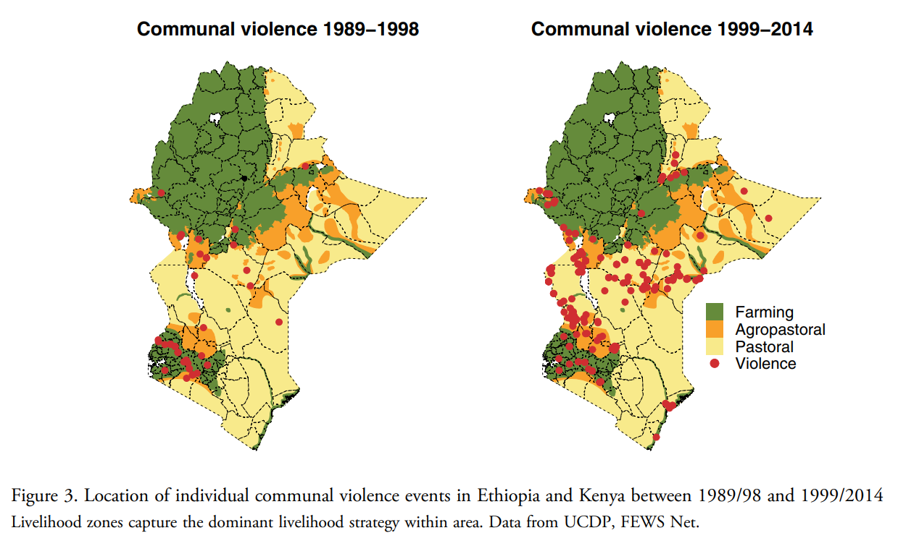
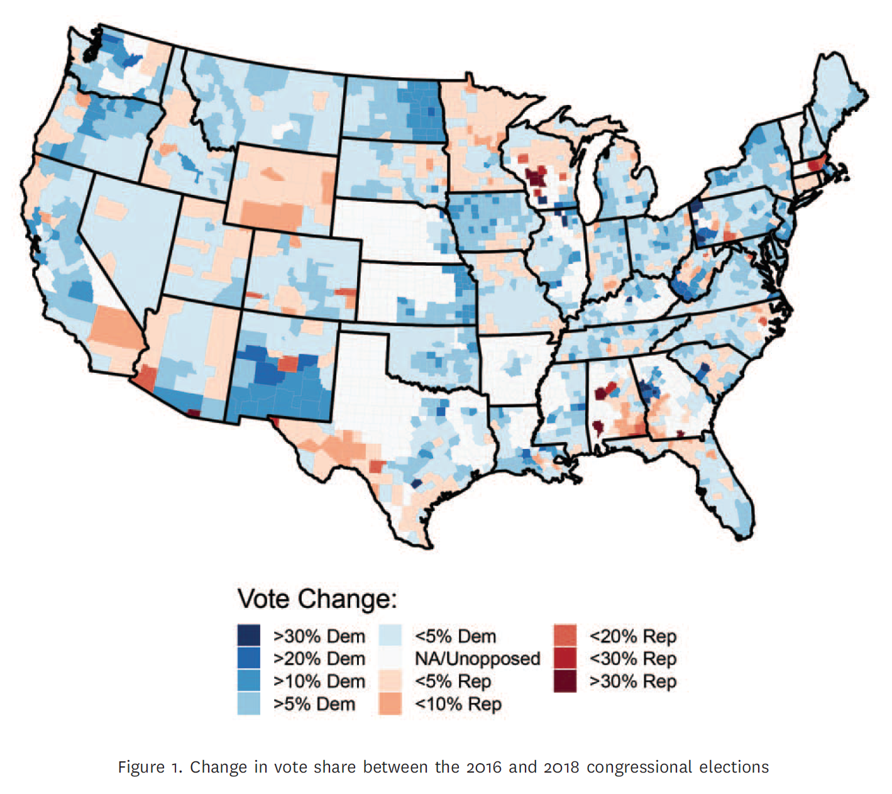

```{r  setup, message=FALSE, warning=FALSE, include=FALSE}
options(
  htmltools.dir.version = FALSE, # for blogdown
  width = 80,
  tibble.width = 80
)

knitr::opts_chunk$set(
  fig.align = "center",  warning=FALSE, message=FALSE
)

```

## Dependence in Observational Data

- Individuals are nested in social networks

    + Individual decisions are influenced by their friends.

- Provinces are surrounded by other provinces

    + Provinces mimic one another's policies

- Country-level outcomes are often a result of negotiations with other countries:
    
    + Economic or environmental policies
    
---
## Three Mechanisms for Spatial Dependence

- Homophily---similarity in outcomes is endogenous, units are similar because they self-select into the same outcome (e.g., partisan geo-sorting)

- Common exposure---similarity in outcomes is driven by an exogenous factor that affects nearby units (the effect of earthquakes on housing prices)

- Diffusion---nearby units affect each other through learning, imitation, etc (e.g., policy diffusion)


---
 

```{r, echo=F, out.width= "800px",fig.align="center"}

```

Source: van Weezel S. "On climate and conflict: Precipitation decline and communal conflict in Ethiopia and Kenya." *Journal of Peace Research*. 2019;56(4):514--528. 

---
 

```{r, echo=F, out.width= "600px",fig.align="center"}

```

Source: Chyzh, Olga V. and R. Urbatsch. 2021. "Bean Counters: The Effect of Soy Tariffs on Change in Republican Vote Share Between the 2016 and 2018 Elections."*Journal of Politics* 83 (1): 415--419.
  

---
## Necessary `R` Packages
```{r, message=F}
library(ggplot2)
library(tidyverse)
library(magrittr)
library(maps)
library(mapdata)
library(mapproj)


library(devtools)
install_github("ochyzh/classdata")
library(classdata)
install_github("mccormackandrew/mapcan", build_vignettes = TRUE)
library(mapcan)
```

---
## Map Data

```{r}
canada_map<-mapcan(boundaries = "province", type="standard",territories=TRUE)
head(canada_map)
```

---

## Map of Canada
```{r, eval=F}
#Set theme options:
theme_set(theme_grey() + theme(axis.text=element_blank(),
              axis.ticks=element_blank(),
              axis.title.x=element_blank(),
              axis.title.y=element_blank(),
              panel.grid.major = element_blank(),
              panel.grid.minor = element_blank(),
              panel.border = element_blank(),
              panel.background = element_blank(),
		  legend.position="none"))

ggplot(canada_map, aes(long, lat, group = group)) +
  geom_polygon(color="black", fill="white")
```

---

## Map of Canada
```{r, echo=F}
#Set theme options:
theme_set(theme_grey() + theme(axis.text=element_blank(),
              axis.ticks=element_blank(),
              axis.title.x=element_blank(),
              axis.title.y=element_blank(),
              panel.grid.major = element_blank(),
              panel.grid.minor = element_blank(),
              panel.border = element_blank(),
              panel.background = element_blank(),
		  legend.position="none"))
ggplot(canada_map, aes(long, lat, group = group)) +
  geom_polygon(color="black", fill="white")
```

---

## Map of the US

```{r, eval=F}
us_counties<-map_data("maps::county")
ggplot(us_counties, aes(long, lat, group = group)) +
  geom_polygon(color="black", fill="white") 

us_states<-map_data("state")
ggplot(us_counties, aes(long, lat, group = group)) +
  geom_polygon(color="grey", fill="white") +  geom_path(data=us_states, aes(long, lat, group = group),color="black", size=1)+ coord_map("albers",lat0=39, lat1=45)
```

---

## Map of the US
```{r, echo=F, out.width= "600px", fig.align='center'}
us_counties<-map_data("maps::county")
ggplot(us_counties, aes(long, lat, group = group)) +
  geom_polygon(color="black", fill="white") + coord_map("albers",lat0=39, lat1=45)
```

---

## Map of the US
```{r, echo=F, out.width= "600px", fig.align='center'}
us_states<-map_data("state")
ggplot(us_counties, aes(long, lat, group = group)) +
  geom_polygon(color="black", fill="white") +  geom_path(data=us_states, aes(long, lat, group = group),color="black", size=1)+ coord_map("albers",lat0=39, lat1=45)
```

---
## Your Turn

1. Check out the help file for the `map_data` function to find out how to make a map of the world.

2. Can you figure out how to remove Antarctica from the map?

```{r, echo=F, out.width= "400px", fig.align='center'}
world<-map_data("world") %>% filter(region!="Antarctica")
ggplot(world, aes(long, lat, group = group)) +
  geom_polygon(color="black", fill="white") 
```

---


## Choropleth Maps

- Choropleth maps are thematic maps: areas are shaded by the values of a variable

- Must join map data with content data.

- Example: a map of US counties that shows the number of Covid-19 cases. 
   
---

## Join Data on Covid and Map


```{r, echo=F}
data("covid") #from the classdata package
covid %>% arrange(state, county) %>% head()
```

```{r, echo=F}
head(us_counties)
```

---
## Prepare the Datasets for Joining

- Will be joining by *state name* and *county name*

- Must make sure that these are formatted the same in both datasets, e.g. capitalization, the word "county"

- Will introduce a new variable `state_name` that is all lower case

- Can see mismatching cases using `anti_join`

- Also, since a map can only show one temporal period, need to aggregate the `covid` data to the county level (get rid of the temporal dimension)


---
## Prepare the Datasets for Joining

```{r, echo=T, results=F}
library(stringr)
data("covid") #from the classdata package
covid_data <-covid %>% filter(month==10) %>% 
  select(-new_confirmed, -new_deaths) %>% 
  mutate(state_name=tolower(state_name), county=str_replace(county, "county",""), county=trimws(county)) 

nomatch1 <- covid_data %>%
  anti_join(us_counties, by=c("state_name"="region", "county"="subregion"))
unique(cbind(nomatch1$state_name,nomatch1$county))


nomatch2 <- us_counties %>%
  anti_join(covid_data, by=c("region"="state_name", "subregion"="county"))
unique(cbind(nomatch2$region,nomatch2$subregion))

```

---
## Join the Data and Make a Map

```{r, out.width='50%'}
library(viridis)
us_counties %>% left_join(covid_data, by=c("region"="state_name", "subregion"="county")) %>%
ggplot(aes(long, lat, group = group, fill=log10(confirmed/population))) +
  geom_polygon(color="black") + scale_fill_viridis(na.value="white")+ coord_map("albers",lat0=39, lat1=45)
```

---

## Your Turn

Correct as many "gray" counties as you can. Feel free to consult the [`stringr` cheatsheet](https://evoldyn.gitlab.io/evomics-2018/ref-sheets/R_strings.pdf)


```{r,echo=F}
covid_data <-covid %>% filter(month==10) %>% 
  select(-new_confirmed, -new_deaths) %>% 
  mutate(state_name=tolower(state_name), 
         county=str_replace(county, "county",""),
         county=str_replace(county, "parish",""), 
         county=str_replace(county, "city",""),
         county=str_replace(county, "\\.",""),
         county=trimws(county)) 

us_counties %>% left_join(covid_data, by=c("region"="state_name", "subregion"="county")) %>%
ggplot(aes(long, lat, group = group, fill=log10(confirmed/population))) +
  geom_polygon(color="black") + scale_fill_viridis(na.value="white")+ coord_map("albers",lat0=39, lat1=45)
```
---

## Canada Election Results

```{r, eval=F}
library(tidyverse)
library(magrittr)
data("federal_election_results") 
federal_election_results %>% as.data.frame() %>% 
  dplyr::filter(election_year=="2015")->electdata


canada_ridings<-mapcan(boundaries = "ridings", type="standard",territories=TRUE)
head(canada_ridings)

canada_ridings %>% left_join(electdata, by="riding_code") %>%
           ggplot(aes(long, lat, group = group, fill=factor(party)))+
  geom_polygon(color="black") +scale_fill_discrete("Party", type="qual") + theme(legend.position="bottom")


```

---
## Canada Election Results

```{r, echo=F}
library(tidyverse)
library(magrittr)
data("federal_election_results") 
federal_election_results %>% as.data.frame() %>% 
  dplyr::filter(election_year=="2015")->electdata


canada_ridings<-mapcan(boundaries = "ridings", type="standard",territories=TRUE)


canada_ridings %>% left_join(electdata, by="riding_code") %>%
           ggplot(aes(long, lat, group = group, fill=factor(party)))+
  geom_polygon(color="black") +scale_fill_discrete("Party", type="qual") + theme(legend.position="bottom")


```
